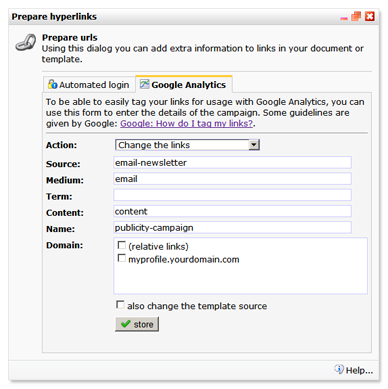

# Prepare your hyperlinks for Google Analytics

Google Analytics supports the integration of different campaigns. To do
so, you have to add special variables to hyperlinks in a newsletter or a
webpage. By adding these variables, you will be able to collect better
and more advanced statistics on your email campaign. Read more about
adding variables to your links in the [Google support
article](https://support.google.com/analytics/answer/1033863?hl=en) on
this subject.

In Copernica, you have the option to add all these variables at once to
multiple hyperlinks in your email document, template or webpage.

Use the form in the *Prepare hyperlinks…* dialog screen in the document
or template menu to add new variables, or change or delete existing
campaign variables.

Select '*also apply to the template source code*’ to add the variables
to the hyperlinks in the template source code. Please note that
modifications made in the template source affect all documents based on
this template.

#### What are relative links?

A relative link is a destination related to the location of the current
webpage. This could for instance be a link on your homepage to your
contact page: \<a href="contact.html"\>

Tagging relative links is only useful on webpages, because in emails you
actually never use relative links. A hyperlink in a mailing always
starts with http:// or https://, or a pound sign (\#) if you use anchor
links in your email document or template.

 
