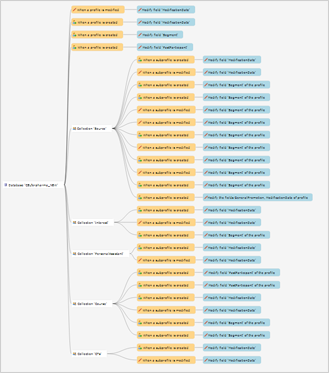
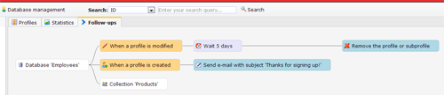
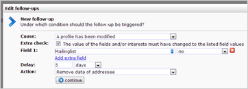

# Follow up manager

The follow-up manager provides a handy overview of all follow-ups that
are linked to a database, document, form or survey. Also, from here you
manage all follow-ups. You can create new follow-ups and edit or remove
existing follow-ups.

***Image:** database with multiple collections and their follow-ups.*

The follow-up manager is located behind an additional tab at the
database, form, document, or survey.

***Image:** This database has two follow-ups. When a new profile is
created, an email will be sent to the profile. The other follow-up
removes the profile entirely, 5 days after the a profile opted out.*

### Create new follow-ups

If no follow-up actions are linked, you can immediately create one. This
will open the program to make new follow-up actions. The same
functionality can also be accessed via the database / document / form /
survey menu.

To add a new follow-up, click on the item. From here you can also delete
or edit existing follow-up actions.

-   To edit the cause of an existing follow-up action, click the cause
    (a 'cause' is for example: when a profile is modified)
-   To set the delay of the follow-up, click the delay (eg 'Wait 5
    days').
-   To edit the action, click the action of the follow-up (eg: Remove
    the profile or subprofile).

***Image:** editing the settings of the follow-up*
