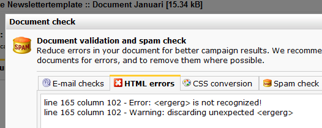

Having lots of HTML errors in your template and document may affect your
deliverability. It is advised to reduce errors to a minimum.

To see if your template and/or document has any HTML errors, click on
the warnings button in the lower toolbar of the screen.

This check provides some information on the found error and how you
could solve it. \
 Some HTML errors may only come up when the document is
**personalized**. Select the *personalized checkbox* in the lower left
corner to validate the personalized document using the [test
destination](./what-is-the-test-destination.md).

Document check dialog window. Click on the **errors and warnings
button** below the document to open the dialog window.

Common HTML errors are
----------------------

**Warning: \ lacks "alt" attribute**\
 The image has no alt attribute. You should solve this, because not
everyone is able to see your images. The alt attribute provides an
alternative description for when the image is not loaded. \
\
``**\
 Warning: \<*table*\> lacks "summary" attribute**\
 You can remove this warning by adding summary="" attribute to table
tags in your template and document. You may also ignore this warning. It
is certainly no show stopper. \
\
**Warning: trimming empty \<*span*\>**\
 Most HTML tags have opening and closing tags. If you see this warning,
the closing tag is missing. \
\
`Content goes here   Some HTML tags are self closed:  `\
**\
 Warning: discarding unexpected \</td\>**\
 Most HTML tags have opening and closing tags. If you see this warning,
the opening tag is missing. \
\
`<td>This is a table cell</td>`**\
 Error: \<dfgsdfg\> is not recognized!**\
 The tag does not exist. Check for misspellings. \
**\
 Warning: missing \<!DOCTYPE\> declaration**\
 The HTML doctype is missing in the template. You may ignore this
warning. \
**\
 Warning: \<html element\> proprietary attribute "*attribute name*"**\
 The HTML element has an non-existing attribute. Remove the attribute or
check for spelling errors.
