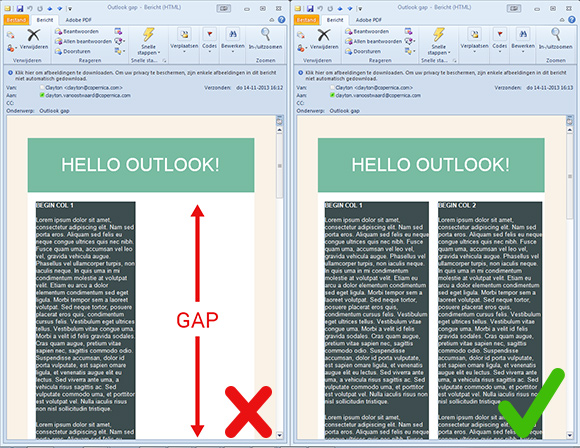

In some cases, Outlook 2007 and 2010 magically render unwanted gaps in
your HTML email. Especially when you're using two columns and your email
is supposed to be
[responsive](./how-to-create-a-responsive-html-email-from-scratch.md "How to create a responsive HTML email from scratch").
Are you running into this little problem? Hopefully this article will
help you fix it once and for all.

The problem
-----------

If your email looks like the one with the red X in the screenshot below,
you probably are a victim of how Outlook 2007 and 2010 renders HTML
emails.



The cause
---------

At first it may look like someone forgot to tell the table cells
(*'\<td\>'*) to vertically align (*"valign=top"*) everything to the top.
But this problem occurs in different setups e.g. nested tables inside a
larger table or when you have two or more columns that stretch very long
in height. But the bottom line is, if one table/column stretches way too
long, around 1600px according to my tests, Outlook makes a boo-boo.

### Example code

The HTML code structure used in the example above is as follows:

*By the way, I left out any styling because I just want to show you the
structure of the email you saw in the screenshot earlier.*

```
<!-- Main (large) table: holds everything inside together -->
<table border="0" cellpadding="0" cellspacing="0" width="500" summary="Main table">
    <tr>
        <td>
            <!-- Header and columns table: holds the title and columns of this email -->
            <table border="0" cellpadding="0" cellspacing="0" align="center" width="500" summary="Header table">
                <tr>
                    <td align="center">Hello Outlook!</td>
                </tr>
                <tr>
                    <td>
                        <!-- Column table: first column of this email -->
                        <table border="0" cellpadding="0" cellspacing="0" align="left" width="45%" summary="Column 1">
                            <tr>
                                <td>A lot of content</td>
                            </tr>
                        </table>
                        <!-- Column table: second column of this email -->
                        <table border="0" cellpadding="0" cellspacing="0" align="right" width="45%" summary="Column 2">
                            <tr>
                                <td>A lot of content</td>
                            </tr>
                        </table>
                    </td>
                </tr>
            </table>
        </td>
    </tr>
</table>
```

Looks normal, doesn't it? Sadly the outcome is a bit different.

Solutions
---------

One solution is quite simple: just write less content. Plain and simple.
But you and me both know that's not going to happen. So luckily, there
are a few other things you can do.

### Solution \#1: Collapse your tables

This is the most simple and quickest fix you can use. By collapsing your
tables with
[border-collapse](http://css-tricks.com/almanac/properties/b/border-collapse/ "border-collapse")
you remove any space and borders between the table cells, so you are
left with only one border. In some cases there is not enough room to
align two columns next to each other, so one column pushes the other
away.

```
table {border-collapse: collapse;}
```

### Solution \#2: Don't nest tables and use TD instead of TABLE for columns

Too be honest, this fix is only useful if your email doesn't have to be
responsive. The truth is, you can't easily stack two TDs on top of each
other like the responsive approach. However, by using TDs you remove an
extra table that can increase in height and eventually break down in
Outlook. Also, if you're using a main table around your email as a
background layer, you can replace that table with a span tag set to
display block. This way you can still add a background color.

So instead of using tables:

```
<table border="0" cellpadding="0" cellspacing="0" align="left" width="500" summary="Columns table">
    <tr>
        <!-- Column table: first column of this email -->
        <table border="0" cellpadding="0" cellspacing="0" align="left" width="45%" summary="Column 1">
            <tr>
                <td>A lot of content</td>
            </tr>
        </table>
        <!-- Column table: second column of this email -->
        <table border="0" cellpadding="0" cellspacing="0" align="right" width="45%" summary="Column 2">
            <tr>
                <td>A lot of content</td>
            </tr>
        </table>
    </tr>
</table>
```

You should use tds like this:

*Don't forget to add *valign="top"*, otherwise the shortest column will
start at the middle of the tallest column.*

```
<table border="0" cellpadding="0" cellspacing="0" align="left" width="500" summary="Columns table">
    <tr>
        <td valign="top">A lot of content</td>
        <td valign="top">A lot of content</td>
    </tr>
</table>
```

### Solution \#3: Use conditional statements to target Microsoft Outlook in general

This fix works best if your email needs to be responsive, which means
that you are probably using tables that align to the left and right if
you are going for the 2-column look. In the end, this solution is
similar to solution \#2, because you'll be using TDs instead of tables.

**Wait...what? Conditional statements?**

Have you ever used conditional statements to target e.g. Internet
Explorer 6 when building a website? Good news! You can also target
Microsoft Office (Outlook).

For example:

```
<!--[if gte mso 9]>
    <style type="text/css">
        Microsoft Office (Outlook) specific CSS goes here
    </style>
<![endif]-->
```

The keyword 'mso' stands for Microsoft Office. Using 'gt' and 'lte' will
target versions greater than, or less than or equal to, respectively.
You're basically telling versions of Outlook that are greater (or later)
than 2000 to use your special CSS. Here's a list of Outlook versions
that correspond to the version number you can use in the conditional
statements:

-   Outlook 2000 - Version 9
-   Outlook 2002 - Version 10
-   Outlook 2003 - Version 11
-   Outlook 2007 - Version 12
-   Outlook 2010 - Version 14
-   Outlook 2013 - Version 15

Let's put the conditional statements to good use. Like I said before,
this solution is similar to solution \#2. We need to remove nested
tables whenever the email is opened in Outlook. Readers using Outlook as
an email client won't notice any difference, unless they dive into the
code.

I'll be targeting non Outlook clients to use the nested tables.
Targeting non-Outlook clients is easy, just use '**!mso**' instead of
'**gte mso 9**'. With '!mso' you are littererly saying '**not microsoft
office**'.

```
<table border="0" cellpadding="0" cellspacing="0" align="center" width="500" bgcolor="#FFFFFF" summary="">
    <tr>
        <!--[if !mso]><!---->
            <td>
                <table border="1" cellpadding="0" cellspacing="0" align="left" width="45%" summary="">
                    <tr>
                        <!--<![endif]-->
                            <td valign="top">
                                A lot of content
                            </td>
                        <!--[if !mso]><!---->
                    </tr>
                </table>
        <!--<![endif]-->
        <!--[if !mso]><!---->
            <table border="1" cellpadding="0" cellspacing="0" align="right" width="45%" summary="">
                <tr>
                    <!--<![endif]-->
                        <td valign="top">
                            A lot of content
                        </td>
                        <!--[if !mso]><!---->
                </tr>
            </table>
        </td>
    <!--<![endif]-->
    </tr>
</table>
```

Have fun testing!
-----------------

If you have anything to add, or need any help, please let me know in the
comments section.
