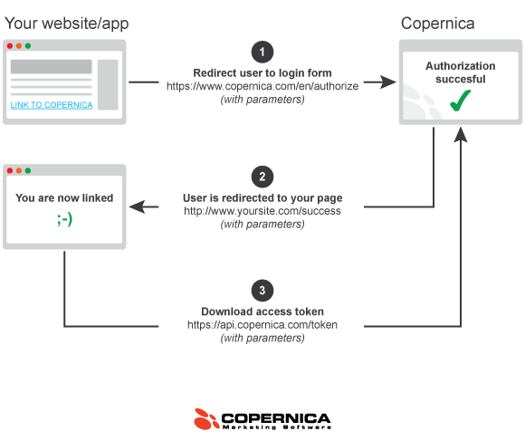

# OAuth authentication

The authentication system of the Copernica REST API uses OAuth2. This is a 
powerful and standardized protocol that is used by many websites and 
applications to control access to the API. The OAuth2 protocol makes a clear 
distinction between two different aspects of API access: (1) applications 
that have access to the REST API, and (2) the list of accounts to which
each registered application has access.

Because we use this OAuth2 protocol, you need to take two steps to get access
to the API: you first have to register your website of app with Copernica, and then
you have to give your application access to your account. After you've taken
these two steps (which you can do both via the [www.copernica.com dashboard](/en/applications))
you will be handed an *access key* that you can use to access the REST API.

But you can do more with the OAuth2 than just fetching an access key to access
your own account. You probably are already familiar with OAuth2, because it is
used by many different websites. For example, the "log in with Facebook" buttons
that you find all over the internet are based on this protocol too. When 
you click on such a button, you are automatically redirected to Facebook where
a text is displayed like "Website X wants access to your email address, contact
list, et cetera. Is that OK with you?". After you have confirmed this access
you are redirected back to the original website, which now has access to your
Facebook profile. A similar thing can be done with Copernica.

## Do you actually need this?

Before you continue reading this article, you must first wonder whether you 
need this feature in the first place. If all you need is API access to retrieve and 
update data in your own account, you probably don't. All you need then is the single
access key that can be fetched from the dashboard. This is sufficient for the vast
majority of Copernica users.

The OAuth2 protocol only makes sense if you have an application that you want
to connect to many different accounts - events to accounts that do not even
belong to you. Imagine for example that you build a website that uses artificial
intelligence to analyze Copernica-databases and that optimizes selections. This
tool is not only useful for yourself, but of great value for others too. You 
can add a button to this website: "click here to analyze your own database".
If someone clicks this button he is redirected to Copernica.com where he
gets a question like "the database-analyzer wants access to your account to
analyze your database. Do you want to give this access?". If the user allows
this access, he is redirected back to your website, and from that moment on
your website can fetch data from the Copernica account of that other user.

## Registering your application

The very first step in setting up your own OAuth2 authoration button is 
registering your website or app with Copernica. You can do this via the 
[dashboard op www.copernica.com](/en/applications). Ensure that the name
and description of your application are clear and understandable, because
this is the information that is displayed to users who click on the button.
The application name and description will be included in the "application X wants
access to your account" message on Copernica.com.

After you've registered your application, you will receive a *client_key* and
*client_secret*. This is the login information of your application, and you
need it when you're redirecting a user to Copernica.com. The *client_secret*
variable must be kept secret, you should never give it to a user of your
website, and use it only in calls to the Copernica REST API.

## The button or hyperlink

You can create an authorization button or link on your website with the login 
data of your application (the *client_key* and *client_secret* variables).
This button should be added to your website or app, and must have the following URL:

`https://www.copernica.com/nl/authorize?client_id=XXX&redirect_uri=XXX&state=XXX&response_type=code`

A number of variables in this URL are set to XXX and have to be replaced by
other values.

* **client_id**: the value of the *client_key* of your applicatie
* **redirect_uri**: the full address (url) of the page on your website to which the user should be redirected after he gave you access to his account
* **state**: a difficult to guess random string generated by yourself (you need a different value for every user that clicks the link!)
* **response_type**: this should be set to the value *code*

Do make sure that the **state** parameter is indeed hard to guess. If we do not
like the string (too short, too predictable) we will not open up an accounts.

## The return page

After you've added the button to your website, you must also make the return page.
This is the page to which users return after they've clicked the button on your
website and after they've given you access on the Copernica.com website. Copernica
adds two parameters to the URL of this page: *state* and *code*.

You need to do two different things on the return page. First you must check whether
the value of the *state* variable matches the random string that you had created.
If this does not match, you should ignore the request because something strange
is going on (abuse!). 

If the *state* variable turns out to be OK, you can use the REST API to fetch
the actual *access key*. You should send a HTTP GET request to the following
URL:

`https://api.copernica.com/v1/token?client_id=XXX&client_secret=XXX&redirect_uri=XXX&code=XXX`

This address also contains a number of XXX parameters that have to set:

* **client_id**: should be set to the *client_key* of your application
* **client_secret**: should be set to the *client_secret* of your application
* **redirect_uri**: this should be the same address that you set in the link or button
* **code**: you should copy the *code* parameter that was added by Copernica to the redirect url

Remember that this URL is an address to the REST API. You should not give the 
URL to the user, and you also do not have to redirect to user to this address. 
Your server is supposed to make a HTTP GET request to this address to download
the access key. The *redirect_url* parameter in the URL is not used. No user 
will be redirected to this URL. The only reason why you need to add this parameter
is because we want to check that the access key retrievel comes from the 
expected source.

If all things work out, the HTTP GET call will give you a small JSON document
containing an *access_token*. This is the token that you can then use to start
making API calls on behalf of the user who gave you access to his account.

`{ access_token : "ed430a95c58fd7d2830c9dc453396cf5" }`

## More information

* [Introduction to the REST API](rest-api)
