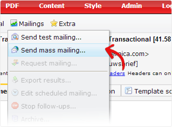
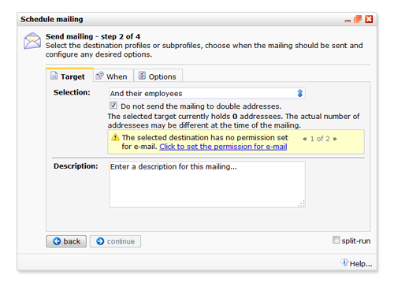
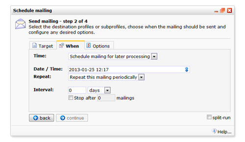
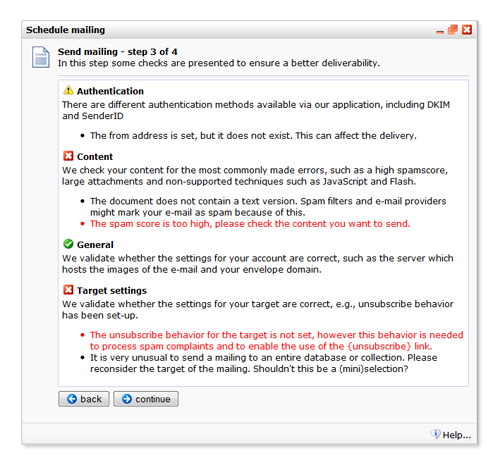

Emailing multiple contacts at once is called *mass mailing*. To send a
mass mailing, first open the document that you want to send, then choose
*Send mass mailing* from the *Mailings* menu. 

-   [Have you already tested your document in a test mailing?](./send-a-test-mail-or-test-mailing.md)

Setting up the mass mailing
---------------------------

Sending a mass mailing is done in four steps. First you are asked to
agree to the terms of service. The second step concerns all settings and
conditions for the mailing. Step three will tell you if it is generally
a good idea to send this document to the selected target (it will help
you to improve the deliverability of your email). The latest check is a
final check and sends the mailing (after a confirmation).

**Be careful:**once you have hit the send button on the confirmation
page, it cannot be stopped. 

To send a mass mailing, a few things are required. Some of them are only
need to be set once.

-   **The proper access rights.** Only style administrators and account
    administrators can start a mass mailing themselves. If you are not a
    style administrator, ask the account administrator to upgrade your
    access rights.
-   **The document that you want to send.** Above the document, you have
    entered the *sender name*, the *sender address* and the *subject
    line* of the document.
-   **The application knows where he can find the email addresses.**To
    send a mailing, the application needs to know in which database
    field you have stored the email addresses. If you haven't done this
    yet, you are prompted to designate a field directly after you have
    chosen the target of the mailing.
-   **You have configured the unsubscribe behaviour for the target
    database or collection.** This behaviour is activated when a
    recipient clicks on the {unsubscribe} link in your email, or marked
    your email as spam. The ubsubscribe behaviour is set from the
    Database management menu under Profiles.
-   **You have approved the target of the mailing for this action.** To
    prevent that mailings are mistakenly being sent to the wrong
    selection or miniselection, you first need to tell the application
    which selection(s) may be used for mass mailings or mailings of
    other types. If the (mini)selection doesn't have this approval yet,
    you can do this right away.
-   **Your emailing has no critical errors.** Among other things, the
    document, sender settings and authentication settings are checked
    for errors. This is implemented to reduce the probability that your
    emails get trapped in spam folders. Critical errors will prevent you
    from sending the mailing, less critical errors can be ignored. It is
    nonetheless advised to reduce the number of errors to a minimum for
    the best delivery and campaign results. 

First step - terms and conditions {.warning}
---------------------------------

Agree to the terms of conditions. Doing this will bring you to the next
step.

Second step - mass mailing settings and conditions {.warning}
--------------------------------------------------

In this step you first select the target of the mailing. This can be a
selection, or a miniselection.

-   Select to which database/selection and possibly mini-selection you
    wish to send the mailing.
-   If you have duplicate email addresses in your database, check the
    box to exclude mail addresses that are double. The option is
    selected by default.

The description is meant as a reference to yourself for later.

### Timing of the mailing

The e-mail can be sent only once, straight away (send immediately) or
set for later or to repeat several times (schedule for later
processing).

The scheduling option (in the tab 'When') allows you to enter a date and
time to send the e-mail and the possibility to repeat the mailing
periodically at an interval and frequency of your choosing. Each time
the e-mail is sent, it will use the profiles that are in the selection
at that moment.

**Note:**You can maintain your document while it’s scheduled for
sending. The modified version will be sent.

### Mass mailing options

Determine the settings for the mass mailing. **The default options are
appropriate for most users. **

**Types**: If you have a text version, send both the HTML and text
version. The text version is a back-up displayed to recipients who
cannot see HTML. Otherwise you can only send the formatted version.

-   Check **personalize** if the e-mail contains personalization code.
-   Check **this is a test mailing** if you do not want the mailing to
    be registered in the contact history of the profile.
-   Select **images are embedded in the mailing** to send images along
    with the e-mail. Using this setting will limit the delivery to 50
    destinations per minute. Modern email clients show the images as
    attachment. We disadvise embedding images!
-   Select the option ‘*Cache external images*’ to copy external images
    used in your emailing to our servers. In this way, images remain
    available in the email when they are later removed from the external
    server.
-   **Speed**: If you wish to slow down the delivery of the e-mail,
    check the '**limit the delivery**' option. For example limit your
    delivery rate to prevent your website from being seized by a very
    large amount of recipients pointing to your website on the same
    moment. **Note:** You can set the delivery rate more accurately from
    the delivery settings in the admin panel.

### Split run mailing

Split run testing enables you to send different versions of a document
in one mass mailing. The different versions are sent to small groups of
contacts, to test the effectiveness of each version. Based on the
results of the test mailings, the system will send the most effective
document to all remaining contacts**.**

-   More information about sending splitrun mailings is currently only
    available in the Help documentation in the software

Step 3 - check the emailing for errors
--------------------------------------

When you're done with your settings, click *continue*to proceed to the
mailing error checker. For the best delivery, your mailing is first
being checked for errors in email and sender authentication, the content
of the email (e.g. can it be recognized as spam), general account
settings (should be ok) and the settings for the target database or
collections.

Critical errors will prevent you from sending the mailing, less critical
errors can be ignored.

Step 4 - confirmation page
--------------------------

The latest step lets you to check all settings made in the previous
steps. Double check everything. Click 'back' to change the mailing
settings. If you are certain of everything you're ready to go. Hit the
send button!

**Caution:**once you have hit the send button on the confirmation page,
it cannot be stopped!

The mailing will now be sent according to your settings. [Curious to the
results of the mailing](./view-the-results-of-your-mailing.md)?
