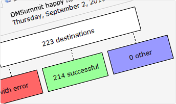

With Copernica you can send text messages to one or more of your
contacts in just a few easy steps. With Copernica's solutions this is
just as easy as sending a text message on your own smartphone. Use the
[selections](./define-target-groups-with-selections.md "Segment using selections")
you've created in your Copernica database to send text messages to
multiple contacts.

Send targeted messages
----------------------

With the selections you create in your Copernica
[database](./creating-your-own-databases.md "Creating your own database"),
you can easily send [personalised text messages](./create-your-text-message.md "Create")
to contacts that, for instance:

-   Subscribed to your newsletter
-   Entered a competition
-   Clicked on a hyperlink in your [emailing](./emailings.md "Emailings")
-   You want to remind of a seminar that starts in hour
-   You want to wish a happy birthday
-   You want to remind of a promotion that has almost expired

Automatically send a text message
---------------------------------

Target your contacts even more effectively by scheduling text messages.
Or would you like send a text message after they've purchased an item
from your website? With Copernica's [follow up manager](./automate-campaigns.md "Automate your campaigns")
you can set up a text message that a contact will automatically receive
after purchasing an item. Do you want to send it directly after the
purchase? Or a day after? Maybe even later? Whatever you choose, you'll
find it easy to schedule with Copernica.

Check the results of your mobile messages
-----------------------------------------

After sending a text message, Copernica will send you an overview with
the results. Want to process these results in a different program to
Copernica? Just export the data with our easy to use export function.
