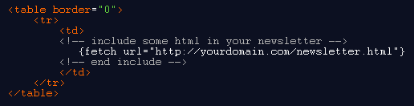

Use the fetch tag to embed additional HTML or other (textual) content
from any online location in your template or document.

The (only) correct syntax is as follows:

**{fetch url="http://domain.com/currentheadlines.txt"}**

