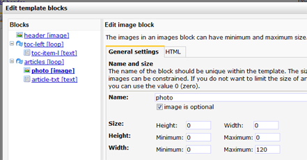
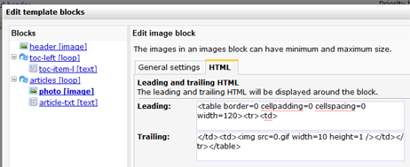

An image tag is the code to add a variable image block to e-mail
documents. It is placed in the source code of an HTML template as:

You can edit and add special formatting to the image block in both the
template source code and via the *template menu \>***Block structure**.

This will affect all documents based on the template.

Note: you must use different names for the individual image blocks in
your template.

Additional options
------------------

Additional options can be set either from the **Edit template
block**dialog (Template menu) or by adding parameters to the image tag
itself.

template block settings. This dialog can be found in the template menu

It is also possible to add these special formatting manually to tag in
the template source code. The following example has all available
options included.

`[image name='article-image' optional='1' maxwidth='320' width='50' height='50' maxheight='10' minwidth='10' minheight='10' begin='Leading HTML code' end='Trailing HTML code'] `

### Image is optional

Check this option if the image should not always appear in the document.
The space reserved for the image will only be visible if an actual image
is added on document level.

`[image name="blabla" optional="yes"]`

### Size

Give images a set **height** and **width** by entering values here.
Deviating images will be resized to fit the setting.

`[image name="picture" width="200" height="200"]`

The above tag will downscale images loaded in the image block to 200x200
pixels.

#### **Max and min height**

Give images a minimum or maximum height. Deviating images that are
uploaded will be resized to comply with the settings. Width will be
adjusted to preserve proportions.

`[image name="header"  maxheight="600" minheight="300"]`

#### **Max and min width**

Give images a minimum or maximum width. Deviating images that are
uploaded will be resized to comply with the settings. Height will be
adjusted to preserve proportions.

`[image name="header"  maxwidth="600" minwidth="300"]`

#### **Leading and trailing HTML**

On this tab special format code can be added, similar to adding HTML in
the source code. The HTML is only loaded if the image block is also
loaded in the document. This allows you to add special formatting to the
image without affecting the lay-out if the (optional) image block is
left empty in the document.

The same is accomplished in the image tag in the template source code
using the begin and end parameters. It is advised to enclose HTML
attribute names with double quotes.

`[image name='nameofblock' begin='
' end='
']`
