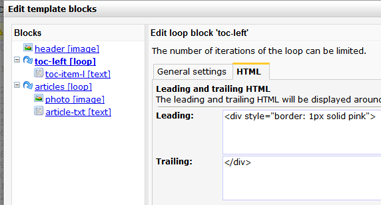

In email and webtemplates you can use loop blocks to repeat snippets of
HTML and other blocks in the document. At the document you specify how
often you want to repeat the block. At each iteration, you can add
different content. This allows you for example to add multiple articles
to your newsletter using the same formatting.

A loop block is easily added to the HTML source code of a template. For
this you use the code:

    [loop name="name of the block"]
        Part that you want to repeat
    [/loop]

The part within the opening and closing tags can be just plain HTML
code, but of course you can also add text blocks and image blocks.

You can also create nested loops by placing another loop block (or even
multiple blocks) within the opening and closing tags.

**Img:*** Code snippet of the Copernica newsletter, with image, text and
(nested) loop blocks. *

### Specify the number of iterations

How many times a loop block can be repeated, you specify at document
level.

-   Open the document
-   Click on **Edit mode**(directly below the opened document)
-   The blocks in your document will now become clickable.
-   **Click**on the block you want to edit.
-   In the dialog screen, **click**the name of the loop block. Click the
    **Iterations tab**and enter how many times the loop block should be
    repeated.

### Changing the order of the iterations

The order of iterations can be edited from the tab Iterations.

### Show iterations conditionally

It is not yet possible to make conditions on iterations level.

### Additional options for loop blocks

There are various additional options available for loop blocks, such as
limiting the number of max iterations.

-   In the menu Template, choose **Edit block structure**
-   The following dialog box will open.

### The options:

**Name -** If you want, you can change the name of a block. To prevent
data loss, make sure that the name you enter does not already exist in
your template.

**Minimum number of iterations**- ****limit the minimum number of
iterations in the document\

**Maximum number of iterations -**limit the maximum number of iterations
in the document\

You can also specify this directly into the template, in the following
way:

`[loop name="name of loop" min="1" max="30"]`

### Add leading and trailing HTML

It is possible to add leading and trailing HTML to a content block. The
HTML is only loaded if the block is actually used in the document. This
is for example useful if a block should always be wrapped inside a
\<div\> with a border and 10px margin, but you want to avoid this border
and margin to be loaded in the document if the block is not used at all.

Add leading and trailing HTML in the tab HTML in the **Edit block
structure** dialog

 

Extra (advanced) options for loop blocks
----------------------------------------

In a [smarty foreach
loop](http://www.smarty.net/docsv2/en/language.function.foreach.tpl), it
is possible to use extra properties such as *iteration*, *index*,
*first*and *last*to retrieve information about the item(s) from the
array that is being iterated.

-   *.index *contains the current loop index, starting with zero
-   *.iteration* contains the current loop iteration, starting with
    zero\*
-   *.first* returns true if the current loop iteration is the initial
    one
-   *.last* returns true if the iteration is the final one

These options are also available for loop blocks.

You can use these options for example to manipulate the content and/or
appearance of a looped item in a loop block.

*\* In the original smarty implementation the iteration starts with one,
however in our implementation this has changed to zero.*

**Note:**currently these advanced loop block function only function in
templates that are rendered in Smarty v2. We are working on a solution
to make them available in smarty 3 templates as well.

### Some examples

Suppose you have a loop block *[loop name=row]* with 3 iterations, you
can now retrieve the current iteration as follows:

`[$loop.row.iteration]`

And add a conditional statement to show different text based on its
iteration:

        [loop name="row"]
            {capture assign="thisrow"}
                [if $loop.row.first]
                    first, 
                [else]
                    other, 
                [/if]
            {/capture}
            {$thisrow}
        [/loop]

Will output with 3 loop iterations:

*First, other, other,*

### Nested loops

If you have nested loops (loop A and loop B) in your template, you can
access the child loop B as follows: *[\$loop.loopA.loopB.iteration]*
