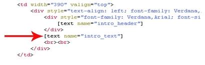
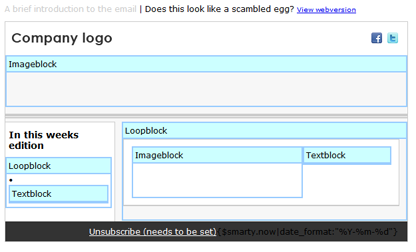
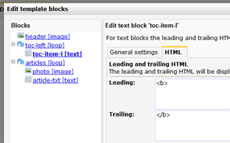

A text tag is the code with which a text block is added to an HTML
template. Documents made with a template that uses the [text] function,
can easily be maintained and re-used over and over again.

A text tag is placed in the source code of the template and looks like:

Layout and formatting of tags influences the content of all underlying
documents.

view a document in **edit mode**, to make the blocks clickable. Click on
a block to edit its content.

### Load the 'poor' HTML editor by default

A text block will load the rich text editor by default. To load the poor
HTML editor instead, add the parameter **editor="poor"** to the text
block tag:

`[text name="article" editor="poor"]`

Note: this will not disable the rich editor. The user is still allowed
to switch to the rich editor.

### Leading and trailing HTML

The templates '**block structure**' function will show all tags present
in the template. You can add style elements here or in the source code.
Make sure to open and close elements in block structure, for example to
make all text in a block bold use '\<strong\>' in Leading and
'\</strong\>' in Trailing.

