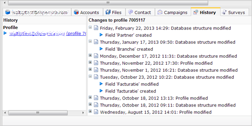
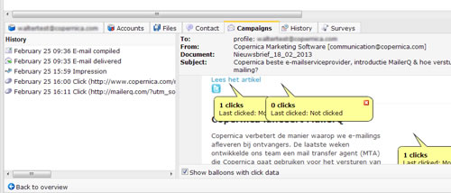

Of each individual profile and subprofile you can view when and how the
profile and its data structure was modified. Also you can see which
campaigns where sent to the profile, including its individual results.

### History of the profile

Of each profile and subprofile we store what changes have occurred in
the profile. Of each historical event you can see the time of the
change, and the type of change.

This way you can for instance find out exacly when a profile registered
for your newsletter. You can see all changes from the creation date of
the profile or subprofile.

Optionally, you can restore a profile to a previous state. For this use
the *Rollback profile...* function, found in the bottom toolbar.

**Note**: When you delete a profile, you also permanently delete its
history information. If you copy a profile or database, you only copy
the profile information. The profile and campaign history will not be
copied to the new profile.

### Individual campaign results

Of each profile you have a chronological overview of the results of
emailings, sms etc. mailings that are sent to the profile.

In this way you can find out if someone actually received a mail, and
which results have been recorded.

Upon delivery of an email you can see exactly what happened in each step
and at what time

-   Email compiled: the message is composed and personalized for its
    destination and moved to the outbox. It will soon be offered to the
    receiving mail server
-   If any errors occurred during the delivery, you can see more
    information about each delivery attempt (by default, we do a total
    of 20 attempts before we give up delivery).
-   Email delivered: the message is accepted by the receiving mail
    server, and (most likely) delivered to the inbox of the recipient.
-   Of course you also see the impressions and clicks recorded.

On the right side you see the personalized email, as it is sent to the
profile or subprofile. At each hyperlink you see how many clicks were
recorded.

