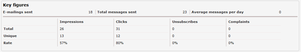

Sent your first mailing and wondering how successful it was? Use our
emailing statistics to find out.

Where do I find my mailing statistics?
--------------------------------------

The statistics for all mailings sent with the application can be found
in the Emailings section.

-   In the menu *Mailings* click***Statistics**.*
-   Find select your mailing and then click  ‘**Show full statistics
    report’**.
-   You may use the **filter options** to narrow your search.

Where do I find the results of my scheduled mailing?
----------------------------------------------------

To view the results of mailings sent in a scheduled mailing:

-   In the menu *Mailings*click **Scheduled mailings**
-   Find and select your mailing in the list
-   Click **Show full statistics report**

To view the reports of a separate mailing sent in the scheduled mailing,
click on the mailing in the top right corner of the screen.

Statistics key figures
----------------------

The mailing key figures provides you a quick overview of the results of
your mailing. This article explains you the figures presented in this
overview.

**Emailings sent:**These are the total number of emailings that have
been sent  with the account, template or document, in the set period of
time.

**Total messages sent:** The sum of messages that have been sent with
the account, template or document.

**Average messages per day:** Total messages sent divided by the total
days in set period of time that have been sent with the account,
template or document.

**Total impressions:** Total impressions recorded. An impression is
recorded when a destination opens the email, and downloads the images.
When a destination opens the email, the included images will be
downloaded from our image server, enabling us to track where and when
the image was downloaded and by who. One subscriber can open your e-mail
more than once. He may open it during work time, and subsequently hours
later when he checks his e-mail at home. Both impressions are registered
for the same person.

**Messages with impression:** Unique impressions (each destination is
only counted once).

**Open rate:** Messages with impression devided by the total number of
messages sent \* 100.
