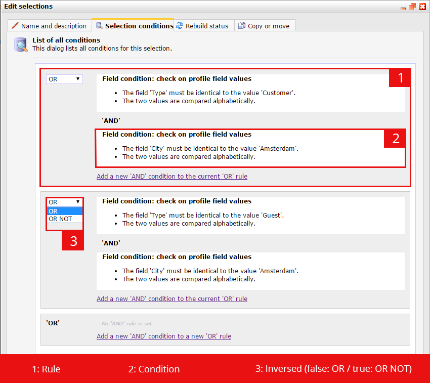

Views, or selections, form one of the basic powers of Copernica. Without
them, a database would be nothing more than a bunch of profiles.
Although selections are usually not adjusted in real time, we created
some methods to create and retrieve selections with the REST API.

The structure of a view/selection
---------------------------------

A selection consists of both rules and conditions. Let's start at the
bottom: the conditions:

### Conditions

There are a lot of different types of conditions available for
selections. For instance the conditions that compare values form the
fields of the profile to a fixed value, which can be a string, numeric
value or a date(time).

The available types of conditions are:

-   Check on the value of a field
-   Check on content of other selection
-   Check on mailing results
-   Check on survey results
-   Check on date
-   Check on previous exports
-   Check on duplicate profiles
-   Check on interest
-   Check on change
-   Sort and select profiles

The types of conditions demand different parameters. It would be a good
idea to create a selection with some different types of conditions and
use the [/view/\$viewID](./view.md) method (GET-request) to see how these are
organised.

Rules
-----

Rules contain conditions and are used to structure the different
conditions inside a selection. This means that one selection may contain
one or more rules, which contain one or more conditions. The conditions
inside one rule always have an AND-relation. Rules on the other hand
have an OR or OR NOT-relation. By combining them you can construct a
logically complete selection.

If you take a look at the selection editor in the publisher, you can see
the difference between rules and conditions:

