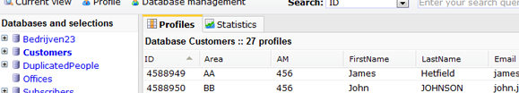
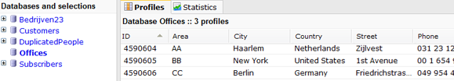
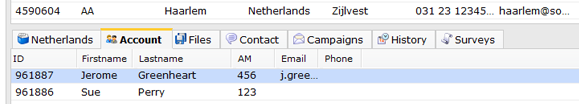

The functions *loadprofile* and *loadsubprofile*allow you to personalize
an email document or template with data from any database and/or
collection. \
The syntax and the working of these functions are explained in detail in
the [loadprofile and
loadsubprofile](http://www.copernica.com/en/support/loadprofile-and-loadsubprofile)
article. In this article, these two functions will be further clarified
using a practical example.

### The situation

Suppose, you work for an international company and you have a database
with information about your **customers** from all over the world.
Depending on their physical location they are divided into several
regional **offices** worldwide.

Several **account managers** working for these regional offfices are
assigned to the customers connected to that office.

You want to send an emailing to new customers who have purchased a
product from your company, and tell them which office they can contact
and also which account manager they can contact.

**In brief:** you need to store the following data and make this
available for document peronalization:

-   Client with client data
-   Office with name and contact information
-   Account manager with name and contact information

Now you could of course store all these data in each database profile
seperately, however this is not very convenient and certainly not very
manageable. Suppose that one office moves to a different physical
location. This would require you to change all of the profiles
affiliated with this office. \
An easy way to eliminate this problem is by storing the office and
account manager information into a seperate database and then link this
to the individual clients. You can accomplish this with the
*loadprofile* and *loadsubprofile* functions.

-   Loadprofile lets you personalize with data from a different database
    than the database to which you send a mailing.
-   Loadsubprofile lets you personalize from any collection, while the
    mailing is sent to a database (profile).

Ideally, we would have

-   1 database (**Customers**) with all the customers and their
    information
-   1 database (**Offices**) with information about the international
    offices\
     \
     In the database **Offices** we create a collection in which we
    store the account managers working at that offices are stored in
    subprofiles.

### The Customers database

The **Customers database** contains information on all customers. These
customers are assigned to a regional office. The offices are indicated
with a code (in this example AA, BB, CC) in the database field *Area*.
In the same way, the assigned account managers are stored in the the
database field *AM* of the customer profile.

In this database, create a profile and use this as your **test
destination**.

#### The Offices database

The *Offices* database is a seperate database that we use to store
information about the regional offices. Each office has its own profile
and has a database field *Area* which will hold a unique code assigned
to that office. This code will later be used to connect each profile
from the *Customers* database to an office.

#### The collection Account

In the Offices database, create a collection *Accounts*. This collection
is used to store contact details and other information about the account
managers working at that office. Each account manager is classified with
a unique code in the collection field *AM*.

So far the organization of the database. Add some test data to the
databases and collection. Make sure you test different situations, so
create several offices with multiple account managers.

### Personalize your emailing with data on customer, office and account manager

The email document will be personalized as follows:

> *Dear [name customer],*
>
> *You are assigned to our office in [location of the office]. If you
> need anything, just call [office phone].*
>
> *You may also contact me directly via [email account manager].*
>
> *Kind regards,*
>
> *[name account manager]*

Because we use the Customers database as the destination of the mailing,
we can personalize our document using straightforward smarty code.

*Dear {\$FirstName},*

To retreive information about the office we use the loadprofile
function. The following line of code would suffice. Place this code
directly below the body tag in your template HTML source code.

> `{loadprofile source="Offices" Area="$Area" assign="offices"} `

-   Use source to tell the system in which database it should look. In
    this example we use the database Offices.
-   Use the field name searcher to match the correct profile (office)
    with the customer. The two profiles match if the value in the fields
    with the office code *Area*are the same.
-   The data form the the database Office will be assigned to the
    variabel *office.*

As of now, you can show the office phone number using the smarty code

`{$offices.Phone}`

#### Retreive account manager information

Data of all account managers are stored as subprofiles in the collection
**Account** at each office. To personalize the document with data from
this collection, use the *loadsubprofile* function. The following bit of
code will suffice.

`{loadsubprofile source="Offices:Account" AM="$AM" assign="account" profile="$office.id"} `

-   Use *source* to refer to the collection *Account* in the database
    *Offices*.
-   Use the*field name searcher* to match the the customer with the
    correct account manager. This is done with the value from the fields
    *AM*.
-   The data from is assigned to the variable *account*.
-   With the additional parameter *profile="\$office.id"* we make sure
    that only subprofiles from the correct office are retrieved.

As of now we can show the account manager's email address using the
following smarty code:

*{\$account.Phone}*

#### The full code used in this example

{loadprofile source="Offices" Area="\$Area" assign="**office**"}

{loadsubprofile source="Offices:Account" AM="\$AM" assign="**account**"
profile="\$offices.id"}

> Dear **{\$FirstName}**,
>
> You have been assigned to our office in **{\$office.City}**. If you
> need anything, just call **{\$office.Phone}**.
>
> You may also contact me directly via **{\$account.Email}**
>
> Kind regards,
>
> {\$account.Firstname}{\$account.Lastname}\
>  Your account manager.

The result:

Use as much databases and collections as you want. You can combine
loadprofile with smarty conditions (if we do not find what we are
looking for in database X, look for a profile in database Y).

-   [More information and extra options about the loadprofile and
    loadprofile
    functions](http://www.copernica.com/en/support/loadprofile-and-loadsubprofile)

