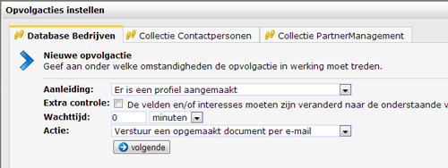

You can create automated responses on your databases and collections.
Each time a profile has been created or modified a follow-up action can
be initiated. You set under which conditions the follow-up should be
triggered, and which action should follow.

To make a new follow-up (or edit an existing one), go to the database
under Profiles, then choose **Follow-ups...** from the *Database
management*menu. Your follow-ups can also be accessed from the
**Follow-ups** tab at the database.

You can create follow-ups on databases and collections.

### Cause and action

A follow-up action consist of two parts: the cause and the action. When
creating a new follow-up action, you are first asked to choose the
cause.

You can choose from 2 different causes for the survey follow-up action:

-   **A profile has been created**
-   **A profile has been modified**

-   **Extra checks**: the follow-up action is scheduled only if the
    value of the field of the profile changed to the value you specified
    here
-   **Delay**: the follow-up action can be executed directly (set: 0
    minutes) or after the period you specify here (for example, one week
    later).
-   **Action:** The actual follow-up action. Choose what should happen
    if the follow-up action is triggered. This may be sending an email
    to the profile or something else.

### Additional conditions for the follow-up actions

Sometimes you want to prevent that a follow-up action is scheduled or
executed. For example, the follow-up should only be scheduled when
survey participant is a customer, not a supplier. Or to prevent that a
follow-up email is not sent to people who have unsusbcribed in the
meantime.

There can be days, weeks, or even years between the scheduling and the
actual execution of a follow-up action. Therefor we differentiate
between **schedule conditions** and**action conditions.**

-   Create a **schedule condition** to ensure that the follow-up action
    will be scheduled under certain conditions only
-   Create an **action condition** to ensure that the follow-up action
    is executed under certain conditions only

### Copy follow-ups

When copying a database or collection, follow-ups are not copied along.

### Remove follow-ups

Follow ups can be removed. Already scheduled follow ups will still be
executed after you remove the follow-up.

### To remove a follow up

-   open the follow-up window
-   Select the follow-up that you wish to remove
-   Click remove

#### Further reading

-   [Conditions for follow-up
    actions](./automate-campaigns-with-follow-up-actions.en.md)
-   [More information on follow-up
    actions](./conditions-for-follow-ups.en.md)
-   [Follow-up
    manager](./follow-up-manager.en.md)

