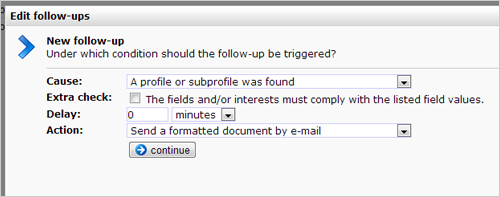

You can create automated responses on your web forms. Each time the web
form is submitted, a follow-up action can be triggered. You set under
which conditions the follow up should be triggered, and which action
should follow.

To make a new follow-up (or edit an existing one), go to the webform
under Content, then choose **Follow-ups...** from the web form menu.
Your follow-ups are also accessed from the **Follow-ups** tab at the web
form.

Cause and action
----------------

A follow-up action consist of two parts: the cause and the action. When
creating a new follow-up action, you are first asked to choose the
cause.

You can choose from three different causes for the web form follow-up
action:

-   **The web form has been submitted**- the follow-up is always
    scheduled (unless the form could not be sent for some reason)
-   **A new (sub)profile was created**- the follow-up action is
    scheduled only when a new (sub) profile is created (not modified)
-   **A profile or subprofile was found**- the follow-up action is
    scheduled only if an existing user from your database is able to
    identify himself (through the key field(s) in your web form)

-   **Extra check:** the follow-up action is performed only if the user
    has given certain answers in the form. First select the field and
    then enter the desired answer in the box.
-   **Delay**: the follow-up action can be executed directly (set: 0
    minutes) or after the period you specify here (for example, one week
    later).
-   **Action:** The actual follow-up action. Choose what should happen
    if the follow-up action is triggered. This may be sending an email
    to the profile or something else.

Additional conditions for the follow-up actions
-----------------------------------------------

Sometimes you want to prevent that a follow-up action is scheduled. For
example, the follow-up should only be scheduled when the submitter of
the form is a customers, not a supplier. Or to prevent that the follow
up is executed for someone who has unsusbcribed in the meantime.

There can be days, weeks, or even years between the scheduling and the
actual execution of a follow-up action. Therefor we differentiate
between **schedule conditions** and**action conditions.**

-   Create a **schedule condition** to ensure that the follow-up action
    will be scheduled under certain conditions only
-   Create an **action condition** to ensure that the follow-up action
    is executed under certain conditions only

More information
----------------

-   [Conditions for follow-up
    actions](http://www.copernica.com/en/support/automate-campaigns-with-follow-up-actions)
-   [More information on follow-up
    actions](http://www.copernica.com/en/support/conditions-for-follow-ups)
-   [Follow-up
    manager](http://www.copernica.com/en/support/follow-up-manager)

