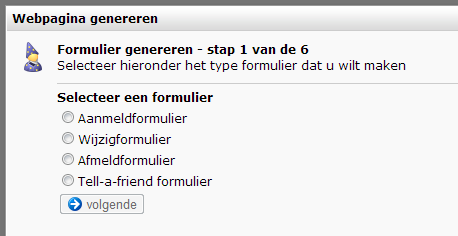

Besides the powerful web forms you create in the Content section,
Copernica offers a functionality that allows you to generate web forms
quick and without a hassle. At the end of the wizard, you will receive a
piece of HTML code that you can insert onto every webpage. This includes
web pages that are not hosted by Copernica.

The web form is deliberately kept quite basic. All fields are
automatically displayed as text fields. You are complete free to adjust
the HTML, and add more styling and functionality with CSS and
Javascript.

### Generate a form

You'll find this feature under **Websites**in the **Web page menu**(at
the very bottom of it)

Select the type of form that you want to generate

-   The **registration form**works in all situations. Note that the form
    can not check whether someone has already signed up before.
-   The **change**and **unsubscribe forms**only work if a visitor
    clicked from an emailing to the webform. If you choose this type of
    web form, make sure you add the login code to the referring link in
    your email. If you want this type of form that works in all
    situation you should opt for a web form created in the Content
    section.
-   **Tell-a-friend** form . Tell-a-friend has now long been overtaken
    by 'Share to Social ' and the concept is actually prohibited by law.
    We recommend not creating a tell a friend form anymore. Though the
    function is still available in the software.

Once you have chosen the type of form you enter the wizard. In the
wizard, you choose the database, and which database fields should be
included in the form.

If desired, you can connect a follow-up action to the form, for example
to send a confirmation mail to a subscriber. You also have the
possibility to send a notification mail to a fixed address, for example
to inform your marketing department that someone subscribed or
whatsoever.

Choose the landing page of the form. The user is redirected to this page
after he submitted the webform.

In the last step you get the HTML. Paste the code into an HTML file,
store it on you computer, and open it with your browser .

Fill in the form and submit it. You will see that it works correcly.

**Note** : Once a form has been created, you cannot subsequently add or
remove fields of the form. You must then generate a new web form.
