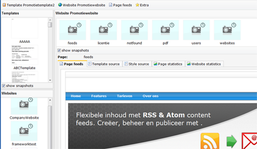
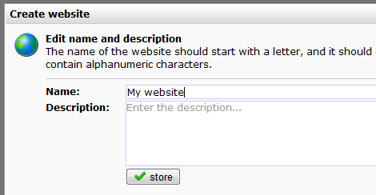
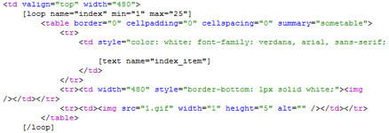
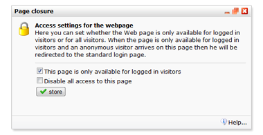

Surveys and webforms that you create under *Content* can only be
published on web pages (not in email documents). Websites and web pages
are created and managed in the *Website* section of the software. Your
website can be linked to a subdomain under your company website adress
(or any other (sub)domain), so that visitors will not see that the
website is hosted by Copernica.

This article will help you get started with creating a first website in
Copernica.

-   [Overview op the Websites section](#websitesoverview)
-   [Web templates and web pages](#Web%20templates%20and%20web%20pages)
-   [Create a new website](#Create%20a%20new%20website)
-   [Create a web template](#Create%20a%20web%20template)
    -   [Editing the template source code](#edittemplatesourcecode)
    -   [Add text, image and loop blocks](#addtextimageandloopblocks)
-   [Publish web form or survey](#Publish%20web%20form%20or%20survey)
-   [Link a domain to your
    website](#Link%20a%20domain%20to%20your%20website)
-   [Linking to a web page from an
    emailing](#Linking%20to%20a%20web%20page%20from%20an%20emailing)
-   [Set the website default page, the error page and the login
    page](#Set%20the%20website%20default%20page%20the%20error%20page%20and%20the%20login%20page)
-   [Hide pages to unknown
    visitors](#Hide%20pages%20to%20unknown%20visitors)
-   [Manage files and images](#Manage%20files%20and%20images)

### Overview of the Website section

In the top left overview you see the available templates and below that,
the different websites created in the account. Click on a website to
edit the web pages created within the website.

### Web templates and web pages

Just like with email documents, when creating a website you use
templates and documents. With the difference that we call a web document
a **web page**. The template is the blue print for your web page. In the
template you determine the lay-out and structure. With the use of
*text*, *image*and *loop blocks*you determine where you want to add
dynamic content later. Web templates and pages can be personalized in
the same way as email documents with the use of smarty code.

Important to know:

-   A website can contain several pages.
-   These individual pages can be based on different web templates.
-   To make the website available online, you need to link it to a
    domain or subdomain. It is possible to link multiple domain names to
    a single website.
-   Opposed to that it is not possible to use the same domain for
    multiple websites.
-   If you have a linked a domain to a website, you can access its web
    pages through http://subdomain.yourdomain.nl/*nameofpage*
-   Only webpages within a website with a valid domain linked are
    billed. Check your license information to see the prices.
-   Web forms and surveys you create in Copernica only function on
    Copernica hosted pages.

### Create a new website

From the *Website*menu, choose *New website*

-   **Choose a name** for the website. This name is used in the software
    only, it is not your domain name.
-   To make your first web page, you need a web template first. To
    create one, you can do any of the following:

### Create a web template

You can create a new template, copy an existing template or import a
template from your computer. Creating your own web template requires
HTML knowledge. If your organization does not have an HTML expert you
may use our default
template, import a
template from an external source or let one of [Copernica's
partners](http://www.copernica.com/en/get-started-with-copernica/partners-overview)
create a template for you.

-   **Create a new template.** From the template menu, choose *New
    template...*and create a basic template using HTML code and content
    blocks.
-   **Import a template.** First create a new (empty) template. Then
    select *Import template*from the *Template*menu. Locate****the
    *HTML* or *ZIP*file (if you included images) on your computer and
    *upload*it to the application.
-   **Use an email template:**Email templates can serve as a basis for
    web pages. Under *Websites*, create a new template, and then choose
    the option *Copy web template or email template*. Copied templates
    can easily be edited. This does not affect the original email
    template.

#### Editing the template source code

Once you have followed the above steps, you can edit the template source
code from the *Template source* tab.

1.  **Click on the template** in the left overview to select the
    template (if it is not already selected).
2.  Your template will be opened in the template work space.
3.  **Click on the Template source tab**. Type something and click on
    store. Hooray, your template is created.

#### Adding the template content blocks

In the template source code you can use special code to create [text
blocks](#), [image blocks](#) and [loop blocks](#). You can add as many
blocks as you want to your template, as long as they have different
names.

**Text blocks**are used to add textual content to your email document.
However any content you can think of can be added to your text blocks.

    [text name="TEXTBLOCKNAME"]

**Image blocks** - As with text blocks, it is also possible to determine
where users can **add images** to the email document. Just include the
following line of code in the template source where you want the image
to be added:

    [image name="IMAGEBLOCKNAME"]

**Loop blocks**are used to repeat image, text blocks or even other loop
blocks within your web pages. For example, if you want to use the same
webtemplate for different pages that contain different amounts of
images, you could create a loop around the image block. This would allow
you to choose how many image blocks to include in the web page, without
changing the underlying HTML code.

    [loop name="LOOPNAME"]Source code that should be repeated[/loop]

A loop and text block used in the template HTML source

### Create a web page

Once you have created a web template and a website, you can start making
web pages.

-   In the left oveview with websites, click the website under which you
    want to make a web page.
-   From the *Page*menu, click *New web page...*
-   Choose the web template for this page.
-   Enter a name for the page. The webpage will later become accessible
    through this name using your internet browser. The name can also be
    adjusted later.
-   Click 'Store'.

Your web page is now created. Click *Edit mode* in the lower toolbar to
edit its content (only if you have included text and/or image blocks).

### Publish web form or survey

Publishing a web form, survey or a Content feed on a web page, is
accomplished through a special tag. Alternatively you can use the
*Include special content* function, which you will find in the screen to
edit the content of a text block.

-   The tag to publish a web form **{webform name="name of the form"}**
-   The tag to publish a survey **{survey name="name of the survey"}**

Click on *Preview mode*in the bottom toolbar to view the web page with
its published content and personalized with data from your *test
destination*. Note that forms and surveys will not work from the
application itself. Testing web forms and surveys requires you to link a
domain to the website, and view it in your web browser.

### Link a domain to your website

To make your website available online, it must have a valid domain or
subdomain. This can be *www.yourdomain.com*, but the vast majority of
users choose to use a subdomain under the domain of their company:
*newsletter.mycompany.com*

**Step 1.** In the DNS\* of your website domain, create a new subdomain.
Point this subdomain to *publisher.copernica.com* using a *CNAME*.

**Step 2.** The subdomain can then be linked to your website in
Copernica via *Website menu \>***Domains...**

\* In order to create a CNAME you need to access the domain DNS
management of your company domain. If you do not have access, ask your
system adminstrator.

Need help creating a CNAME record? Check out the Google help pages on
[creating CNAME
records](http://support.google.com/a/bin/answer.py?hl=en&answer=47283).

### Linking from an email to a web page

To ensure that your subscribers are directly logged in when they click
to your web page from your email, you need to extend the hyperlink with
login code. Adding this code has several advantages:

-   web forms can be prefilled with data of the profile
-   survey results are automatically linked to the respondent and stored
    in the profile or subprofile
-   the web page can be personalized with (sub)profile data
-   the user does not have to login first, because he automatically is.

To let the user login automatically, add the following code to the link
in the email document:

> http://subdomain.yourdomain.nl/namewebpage**?profile={\$profile.id}&code={\$profile.code}**

or when the mailing is sent to subprofiles:

> http://subdomain.yourdomain.nl/namewebpagea**?subprofile={\$subprofile.id}&code={\$subprofile.code}**

If you do not want to add this code manually, you can also use the
function *Prepare Hyperlinks* in the *Document*menu under *Emailings*.

### Set the website default page, the error page and the login page

The software allows you to set which page should be displayed in
specific cases.

You can configure these pages under *Website menu \>***Default
pages...**

-   **Home page:** This page is displayed when someone goes to the
    website without entering a specific web page, for instance:
    *http://subdomain.yourdomain.com/.*
-   **Error page:** This page is displayed when someone attempts to open
    a web page on your website that does not exist, for example
    http://subdomain.yourdomain.com/*eorighnwoernfl* (assuming that
    there is no page on your website with the name *eorighnwoernfl*).
-   **Login Page:**This page is displayed when someone tries to access a
    web page on your website that is accessible only to logged in users.
    On this page you can for example display a login form so the user is
    still able to login (or sign up) when he arrives on this page.

### Hide pages to unknown visitors

By default, all pages you create in the software are visible to the
entire world. To hide specific pages to unknown visitors click *Set
access...*in the *Website*menu

Unknown visitors will then be redirected to the login page that you have
specified as the *default page*(see above).

In the same window, you can (temporarily) deactivate a web page. The
page is then no longer available and visitors of this page will be
redirected to the specified *error page*.

### Manage files and images

Files and images can be uploaded to the template, the document or any
**Media library** (which you can create under *Content*). You can then
use the image in your HTML source by referring to its full name of the
file, such \, or you can load the uploaded image
in a document in an *image block*.

If you want to use an image uploaded to a media library, use

\
