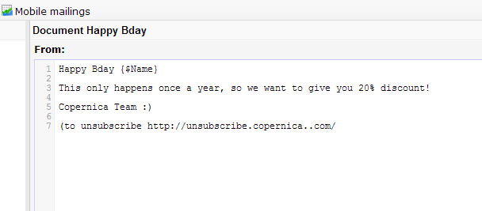

One of the most underestimated features of Copernica might be the [SMS
functionality](./sending-your-text-message.en.md "SMS / text message").
This feature enables you to send personalized SMS / text messages to
your contacts. Wish someone a happy birthday for example, send a
reminder for an event or deliver an order confirmation.

But of course, just like when sending emails, receivers should have the
possibility to unsubscribe for your text messages. How do you handle
these unsubscribes automatically? By following these three steps:

1. Add an extra field to your profiles
--------------------------------------

-   In Copernica, go to *Profiles* and [create an extra database
    field](./profiles-adding-database-fields.en.md "Create a database fields")
-   Choose a multiple choice field, with the options *subscribed* and
    *unsubscribed*

2. Create a webform
-------------------

-   Go to the *Content* sections and [create a change
    webform](./create-change-web-form.en.md "Create a change webform")
-   Include a multiple choice field, and link this to the field you
    created in step 1
-   Add a description to the form, making its purpose clear to its
    visitor: “Would you like to unsubscribe from our SMS list?”

3. Include a link in the text message
-------------------------------------

In the SMS message you create, include a link to the webform:

That's it!

Advantages:
-----------

-   Better opt-out service
-   Automation of the opt-outs
-   Make selections based on SMS/text message unsubscribers

