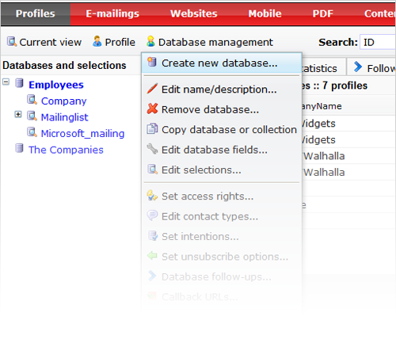

Copernica allows you to create your own databases to collect, manage and
process your relations’ data online. You decide what information about
your relations you want to store and use for marketing campaigns. From
standard name and address information to click throughs in your
newsletters, all the information you need is saved and accessible from
any location.

You are free to structure your database any way you like in
Copernica. There is no limit on the number of [database
fields](./database-and-collection-field-types)
that you can add. 

### Create and manage your database(s)

You can create new databases, and manage databases under **Profiles**.
All functions related to databases are found in the *Database
management*menu.

When you add a new profile to your *database*, you enter information in
the *fields* that are in the *database*. These *fields* can be in a
number of different formats.

An overview of the different types of fields you are able to create and
use within Copernica:

-   Text field
-   Numeric field
-   Multiple choice field
-   Date field
-   Email field
-   Large text field
-   [Interest
    field](./working-with-interest-fields-and-groups)
-   Reference field

### Further reading

-   [Set up your first
    databases](./help-documentation/how-do-i-set-up-my-database)
-   [More information database field
    types](./working-with-interest-fields-and-groups)
-   [Import data to your
    database](./setting-up-your-database-and-import-your-contacts)
-   [Database
    selections](./working-with-selections)
-   [Archiving
    databases](./archiving-databases-and-selections)

