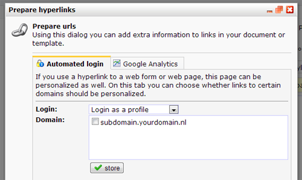

Most users create web pages for use in their email campaigns. For
instance to link to a web page with a web form or survey. Linking to
your web pages is done with normal hyperlinks. For some web forms to
function, it is required that the submitter can be matched with a
profile in your database. To ensure that your subscribers are directly
logged in when they click to your web page from your email, you need
also to extend the hyperlink with login code. Adding this code has
several advantages.

-   web forms can be prefilled with profile data
-   survey results are automatically stored in the profile or subprofile
-   the web page can be personalized with (sub)profile data
-   the subscriber does not have to login first to see your webpages
    that require to login.

To let the user login automatically, add the following code to the link
in the email document:

http://subdomain.yourdomain.nl/namewebpage**?profile={\$profile.id}&code={\$profile.code}**

or when the mailing is sent to subprofiles:

http://subdomain.yourdomain.nl/namewebpage**?subprofile={\$subprofile.id}&code={\$subprofile.code}**

If you do not want to add this code manually, you can also use the
function Prepare Hyperlinks in the Document or Template menu under
Emailings.

