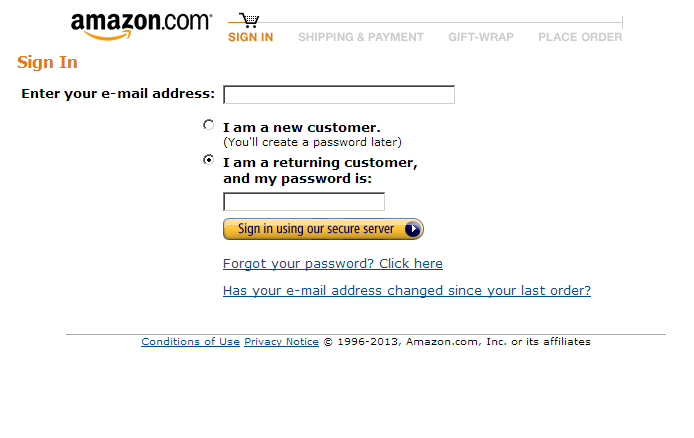
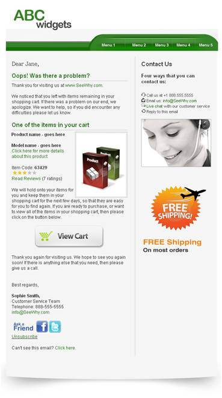

Bezoekers die producten in hun winkelwagen plaatsen en deze vervolgens
niet afrekenen zijn een probleem waar iedere webshop mee te maken
heeft. Deze 'verlaten winkelwagens' bieden een unieke kans om als
webshop de omzet te vergroten met behulp
van [e-mailmarketing](./hoe-versterkt-e-mailmarketing-je-e-commerce-activiteiten.md).

Uit [Amerikaans onderzoek](http://seewhy.com/conversion-academy/) blijkt
dat het versturen van een 'verlaten winkelwagen-e-mail' resulteert in
een gemiddeld conversiepercentage van 20.8% en een gemiddelde omzet van
13,50 euro per verzonden e-mail. (Klik op onderstaande grafiek voor een
grote weergave.)

In de praktijk: ffShoppen.nl
----------------------------

 Wij boeken in de
praktijk vergelijkbare resultaten bij het versturen van [verlaten
winkelwagen-e-mails](./transactionele-e-mails-haal-meer-uit-je-klantcontact.md)
in combinatie met krachtige marketingsoftware. Voor de webshop
[ffShoppen.nl](http://www.ffshoppen.nl/) wordt een conversiepercentage
van 14% behaald. De waarde per bezoeker voor deze e-mailcampagne komt
daarmee op 6,11 euro.

Om van de verlaten winkelwagen-e-mail een succes te maken, is er een
aantal zaken waarmee rekening gehouden moet worden.

A. Vang direct het e-mailadres af
---------------------------------

Om een verlaten winkelwagen-e-mail te kunnen versturen, moet in ieder
geval het e-mailadres van de bezoeker bekend zijn. Belangrijk is dus om
deze bij de eerste stap in het afrekenproces op te vragen. Bij ’s
werelds grootste webshop Amazon.com doen ze dat feilloos. In de
screenshot is de eerste stap van het afrekenproces te zien waarin enkel
om een e-mailadres gevraagd wordt.

Bij andere websites is de kans echter groot dat gewerkt wordt met een
bestaand webshoppakket zoals
[Magento](./haal-het-maximale-uit-je-magento-webshop-met-copernica.md).
Ook dan zijn er mogelijkheden om d.m.v. bestaande extensies of maatwerk
dit proces te optimaliseren.

B. 1-op-1-marketing
-------------------

Het
is belangrijk dat uit de verlaten winkelwagen-e-mail duidelijk blijkt
dat het een ander type e-mail betreft dan de standaard
[HTML-nieuwsbrieven](http://www.marketingfacts.nl/berichten/20110711_html_nieuwsbrieven_opmaken_voor_mobiel_gebruik/)
die je verstuurt. De e-mail moet met name servicegericht zijn en
superrelevant voor de ontvanger. In feite wordt er 1-op-1
gecommuniceerd.

Belangrijk is om stil te staan bij de reden waarom de order niet in
eerste instantie is afgerond. Probeer deze reden te achterhalen en te
adresseren in de e-mail die je verstuurt. Denk hierbij bijvoorbeeld aan
onduidelijkheid op het gebied van de garantie, betrouwbaarheid van de
webshop, de prijs van het product en de verzendkosten.

Ons advies is om de bezoeker niet te belonen dat hij zijn winkelwagen
heeft achtergelaten. Geef dus geen korting op het product of de
verzendkosten als deze in de webshop ook niet van toepassing zijn.

C. Zorg voor het juiste aflevermoment
-------------------------------------

Uit het eerder genoemde onderzoek blijkt dat de kans op een succesvolle
order kleiner wordt naarmate er een langere periode zit tussen het
verlaten van de winkelwagen en het versturen van de e-mail. Wanneer de
e-mail na een uur wordt verzonden, wordt er een conversiepercentage van
11% behaald, na 24 uur is dit gezakt naar 6% en na zeven dagen is dit
nog slechts 3%.

Hieruit blijkt dat het beste moment om de e-mail te versturen een tot
drie uur na het verlaten van de winkelwagen is. Door gebruik te maken
van een API-koppeling tussen je webshop-platform en je marketingsoftware
is het mogelijk deze informatie realtime te synchroniseren en de
verlaten winkelwagen-campagne in te plannen.

Een mogelijkheid die men nog niet veel ziet, is het versturen van
verlaten winkelwagen-e-mails in een serie van drie. De eerste e-mail
wordt dan na een uur verzonden, de tweede na 24 uur en de laatste na 7
dagen. De eerste e-mail bestaat dan uit een vriendelijke herinnering en
de daarop volgende e-mails kunnen uitgebreider ingaan op de redenen
waarom de bestelling niet is afgerond. Het is bij deze opzet verstandig
om de e-mailadressen die de eerste e-mail niet geopend hebben niet meer
op te nemen in de vervolge-mail.

D. CTR, conversiepercentage en omzet
------------------------------------

Door in de e-mail alle uitgaande links uit te breiden met de Google
Analytics-campagnevariabelen meet je eenvoudig de resultaten van de
campagne. Zo ontstaat er inzicht in CTR, conversiepercentage, omzet en
alle overige data die in [Google
Analytics](http://www.marketingfacts.nl/berichten/nieuwe-features-google-analytics-adwords-2012-5-tips-analytics-goed-werken)
te vinden zijn.

Door de campagnevariabelen mee te geven, kan je bij aanpassingen aan de
verlaten winkelwagen-campagne ook meten welke variant van de e-mail het
best presteert. Het is verstandig om aanpassingen altijd te baseren op
cijfers en zo onderbouwd beslissingen te nemen.

E. Remarketing via meerdere kanalen
-----------------------------------

Behalve e-mail als medium te gebruiken voor het inzetten van een
remarketingcampagne, kan je ook gebruikmaken van Google AdWords. Door
binnen AdWords een remarketinglijst aan te maken met daarin alle
profielen die een winkelwagen achtergelaten hebben, kan je ook via het
displaynetwerk de afgehaakte klant overtuigen om alsnog de order te
plaatsen.

Door in de display banner dezelfde boodschap te communiceren als in de
verlaten winkelwagen-e-mail zal dat de boodschap versterken en zorgen
voor een hoog conversiepercentage.

*Dit artikel is geschreven door Sam Engel van
[Digitalbits](http://www.digitalbits.nl/), Registered partner van
Copernica Marketing Software.*

*Dit artikel is reeds verschenen op
[Marketingfacts](http://www.marketingfacts.nl/berichten/5-tips-voor-extra-omzet-via-je-verlaten-winkelwagen-e-mail):
5 tips voor extra omzet via je verlaten winkelwagen e-mail*
