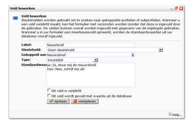
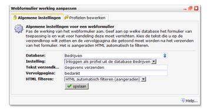
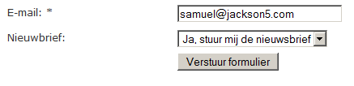

Met behulp van het formulier dat in dit artikel wordt uitgelegd, kunnen
nieuwe gebruikers zich aanmelden, en bestaande gebruikers hun gegevens
wijzigen. Voor deze tutorial heb je een database nodig, een webpagina om
het formulier op te plaatsen, en een webpagina die je instelt als
bedanktpagina van het formulier.

Voor het maken van een dergelijk formulier gaan we gebruik maken van
sleutelvelden. Een sleutelveld is een veld die in de database bij ieder
profiel (en/of subprofiel) een unieke waarde heeft. Het veld met
bijvoorbeeld het e-mailadres, eigen gekozen wachtwoord, of een
klantnummer zijn hiervoor bijzonder geschikt.** **

**Let op:**Het sleutelveld stel je niet in de database in, maar wijs je
aan in het webformulier.

**Maak**in het onderdeel *Content*een nieuw webformulier en
**koppel**deze aan de database met hierin jouw relaties.

-   **Ga** naar *Veld toevoegen*in het webformulier om
    webformuliervelden aan te maken.
-   **Maak** in het webformulier een **nieuw veld**aan en koppel deze
    aan het e-mailadres.
-   Kies bij sleutelveld voor *Minder strikt sleutelveld* (zodat het
    formulier ook matcht als iemand zijn e-mailadres met hoofdletters
    invult).
-   Klik op *opslaan*en voeg (naar eigen wens) nog enkele velden toe.
    Bijvoorbeeld, een keuzelijst die is gekoppeld aan het veld
    *nieuwbriefvoorkeur*in uw database.

**Tip:** door middel van twee colons (::) kan je een andere waarde
wegschrijven naar de database dan de waarde die in het formulier bij een
**checkbox**of **keuzelijst**wordt getoond (bijboorbeeld ja::Ja, ik wil
de nieuwbrief ontvangen)

-   Klik op *opslaan*.

Het formulier moet nu nog de juiste instellingen krijgen. Ga hiervoor
naar *Webformuliermenu \>***Instellingen**

-   Kies bij *instelling*voor **Inloggen als profiel uit de database
    [uwdatabase]**
-   Kies de **tekst verzendknop**vul bij vervolgpagina de naam van de
    webpagina in waar de invuller na het verzenden van het formulier
    naatoe moet worden verwezen
-   **Klik op opslaan**en ga naar het tabblad ‘*Profielen bewerken*’ en
    kies daar voor *‘werking wijzigen’*

Doorloop de wizard en kies hierbij voor de de volgende instellingen:

-   Het formulier werkt met: **elk profiel dat overeenkomt met de
    sleutelvelden**
-   Kies bij zoekresultaten voor *maximaal 1 matches*
-   *Het profiel moet worden bijgewerkt*
-   Wanneer het profiel niet is gevonden, moet het profiel worden
    **toegevoegd**.
-   Sla het deel over database restricties over
-   Klik in het overzicht op ‘*opslaan*’ om de instellingen te bewaren.

Tot slot [plaatst u het formulier in uw
webpagina](./webformulier-op-webpagina-plaatsen.md "Webformulier op webpagina plaatsen").

En zo ziet het gepubliceerde formulier er uit.

Of stuur een e-mail ter bevestiging met behulp van een formulier
opvolgactie\
\
 Niet vergeten te testen he!
