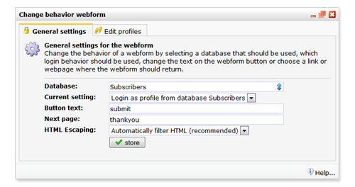
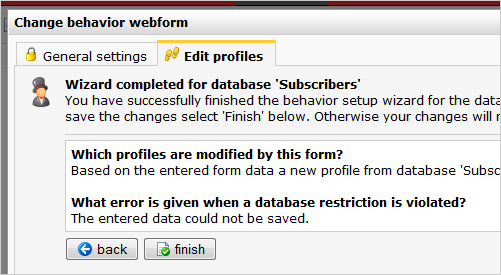

In dit artikel lees je hoe je een aanmeldformulier maakt. Bij het
verzenden van het formulier wordt altijd een nieuw profiel aangemaakt.

Het formulier maken
-------------------

Maak in het onderdeel Content een nieuw webformulier, en voeg minstens
de volgende twee velden toe.

-   **E-mailveld:**koppel dit formulierveld aan het databaseveld waarin
    je de emailadressen bewaart. Het formulierveld mag geen sleutelveld
    zijn.
-   **Permissie veld:**Koppel dit formulierveld aan het veld in je
    database waarin je onderscheid maakt tussen aanmelders en afmelders.
    \
     Maak dit veld een verborgen veld en geef het de standaardwaarde
    'Ja'

Je mag natuurlijk naar eigen gerief meerdere velden toevoegen. In dit
artikel beperken we ons tot 1 zichtbaar veld.

Webformulier instelllingen
--------------------------

Ga naar het webformulier menu, en kies **Instellingen...**

In het tabblad **Algemene instellingen** kies je voor de volgende
instellingen:

-   **Database**: de database waarmee het formulier moet werken. Hier is
    automatisch de database geselecteerd die je bij het aanmaken van het
    formulier hebt ingesteld.
-   **Instelling**: kies hier voor '*Inloggen als profiel uit de
    database [databasenaam]*'
-   **Tekst verzendknop**: dit is de tekst die op de verzendknop komt
    (bijvoorbeeld: Verzenden)
-   **Vervolgpagina**: kies de vervolgpagina. (bijvoorbeeld ‘bedankt’,
    als de vervolgpagina http://www.uwbedrijf.nl/bedankt is)
-   **HTML filteren**. Met deze optie ingeschakeld is de database goed
    beveiligd tegen schadelijke invoer van HTML, scripttaal en
    dergelijke door kwaadwillenden (hackers). 
-   Druk op **opslaan** en ga naar het tabblad Profielen bewerken.

Ga naar het tabblad **Profielen bewerken...**doorloop de wizard met de
volgende instellingen:

Verder..

2 keer verder klikken...

Je hebt nu het einde van de wizard bereikt. Klik op **Afronden** om de
instellingen op te slaan.

Het formulier kan nu worden geplaatst op een webpagina en getest worden.
Succes met het werven van nieuwe lezers.
