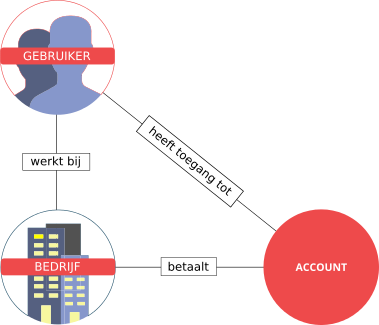

Accounts en gebruikers
======================

In de module gebruikersbeheer kun je een aantal gegevens wijzigen - zoals je bedrijfsnaam of je 
emailadres en wachtwoord - en nieuwe logins voor collega's aanmaken. Ook kun je
via het gebruikersbeheer bepalen wie er toegang heeft tot jouw accounts.
Het account- en gebruikersbeheer van Copernica kan soms wat ingewikkeld 
overkomen. Dit komt doordat Copernica veel met partners werkt.
Dit zijn bijvoorbeeld reclamebureaus, tekstschrijvers en DM en IT bedrijven 
die eindgebruikers ondersteunen bij het inzetten van Copernica. Al deze partners 
hebben op meedere manieren toegang nodig tot de software, omdat ze de software
enerzijds gebruiken voor hun eigen marketingcampagnes, maar ook toegang moeten
hebben om mee te kunnen kijken met hun klanten. Om dit mogelijk te maken, maken we 
in het gebruikersbeheer onderscheid tussen "gebruikers", "accounts" en "bedrijven".

Accounts en bedrijven
---------------------

Zoals beschreven onderscheiden we gebruikers en accounts, en bestaat er eigenlijk
altijd een relatie tussen een account en een bedrijf-in-de-echte-wereld. De meeste 
accounts hebben daarom ook de naam van een bedrijf. Voor veel Copernicagebruikers 
is dit voldoende. Voor partnerbedrijven ligt het echter wat ingewikkelder.

Een Copernicapartner, zoals een reclamebureau, maakt vaak meedere accounts aan
ten behoeve van verschillende klanten. Of het gebeurt dat de partner geen
nieuw account voor een klant aanmaakt, maar wordt ingeschakeld om eens mee te 
kijken met een bestaande Copernicagebruiker die al toegang tot een account heeft en
van de diensten van een externe specialist gebruik wil maken. Om
dit in het gebruikersbeheer mogelijk te maken hebben we een driehoeksverhouding 
van gebruikers, bedrijven en accounts geïntroduceerd:

Bovenstaande driehoeksverhouding maakt het mogelijk om allerlei soorten toegang
tot accounts te verlenen. Een partner kan bijvoorbeeld een account aanmaken (en
betalen voor dit account op basis van de Copernicalicentie), en zowel zijn eigen
medewerkers toegang geven tot het account, als sommige medewerkers van de 
partner-klant.

Maar het is ook mogelijk dat een bedrijf iemand die helemaal niet bij het bedrijf
werkt (een externe marketingspecialist) toegang geeft tot zijn account. Ook zulke
relaties kunnen met worden gelegd. In het gebruikersbeheer kun je, afhankelijk
van je toegangsrechten, allemaal van dit soort relaties aanmaken. 

Hoe werkt dit in de praktijk?
-----------------------------

In de Marketing Suite kun je gebruikers, accounts en bedrijfsgegevens beheren. 
Je kan gebruikers koppelen aan bedrijven en ook gebruikers koppelen aan accounts. 
Als je een "gewone gebruiker" bent (dat wil zeggen je gebruikt een enkel account waar je samen met een paar collega's toegang toe hebt), dan kan dit soms wat dubbelop lijken. Je moet twee lijsten beheren, 
namelijk een lijst van collega's en een lijsten van mensen met toegang tot het account. 
En deze lijsten zijn vaak precies hetzelfde: al je collega's moeten immers ook 
de accountdata kunnen benaderen.

Maar dit komt dus vanwege deze driehoeksstructuur, die je kunt gebruiken als je
meerdere accounts aanmaakt, of als je een niet-collega toch toegang wil geven
tot je account.
