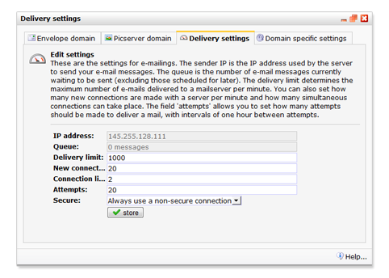

# Geavanceerde verzendinstellingen

In het onderdeel *Beheer*, onder *Account \>***Verzendinstellingen**,
vind je de instellingen voor het versturen van alle berichten vanuit dit
account. Deze kunnen voor een deel verder geconfigureerd worden.

Waarschuwing: De instellingen gelden voor alle mailings verzonden met
dit account.

Envelopedomein
--------------

Het *envelopedomein* is het domein waar via alle e-mail van een licentie
wordt verzonden. Deze kan een beheerder aanpassen in verband met
*deliverability*of *whitelabeling*. Let in dat geval op dat:

Het envelopedomein moet een een geldig domein zijn, en er moet voor dit
domein een geldig *MX record*bestaan dat verwijst naar *mailservers*met
het *IP adres*dat wordt getoond in het dialoogvenster. De ingevoerde
domeinnaam mag geen *CNAME*zijn.

Picserver domain
----------------

Afbeeldingen gebruikt in jouw mailings worden getoond via een speciale
server. Via deze server worden ook de statistieken van je mailing
bijgehouden. Het is mogelijk om een eigen domeinnaam te gebruiken voor
deze server.

Afbeeldingen kunnen dan dan getoond via het adres
*http://verzin-iets.uwbedrijf.nl/..*in plaats van
*http://pic.vicinity.nl/../*

Deze domeinnaam moet een *CNAME* verwijzing hebben die verwijst naar
*pic.vicinity.nl*

IP address
----------

Geeft aan vanaf welk IP-adres de mailing verzonden wordt. Deze kan door
een gebruiker niet aangepast worden.

Wachtrij
--------

De *wachtrij* geeft het aantal e-mailberichten aan dat momenteel in de
wachtrij staat om direct te verzenden. De wachtrij die je ziet staan
gaat over **alle mailingen**die nog verstuurd gaan worden vanuit jouw
account.

Afleverlimiet
-------------

De *afleverlimiet* bepaalt het maximum aantal e-mails dat bij een enkele
mailserver (hotmail, xs4all, ...@bedrijf.nl) per minuut wordt
afgeleverd. De afleverlimiet is niet bedoeld om de totale
verzendsnelheid te beperken, maar om te voorkomen dat een ontvangende
server overbelast raakt met e-mailberichten. Als de afleverlimiet op
1000 staat, zullen niet meer dan 1000 berichten bij 1 specifieke
mailserver (lees: IP adres) worden afgeleverd. Dit aantal van 1000 is
een erg hoge bovengrens: verreweg de meeste ontvangende servers zijn
helemaal niet snel genoeg om zoveel berichten te accepteren, zodat deze
grens eigenlijk nooit wordt behaald.

Verzendlimiet
-------------

Dit kunt je instellen bij het versturen van een mailing. Als deze niet
wordt ingesteld (want het is optioneel), dan wordt de afleverlimiet
gebruikt. Als je deze wel instelt dan kun je opgeven hoeveel berichten
er in zijn totaliteit verstuurd mogen worden per minuut. Als jew
bijvoorbeeld 500 instelt, dan kan het zijn dat er 300 berichten voor
hotmail, 100 berichten voor gmail en 100 berichten voor yahoo verstuurd
worden in die ene minuut. De volgende minuut pakt het systeem weer 500
willekeurige berichten. Deze functionaliteit is voor het verspreiden van
de verzending, als je veel ontvangers heeft en hierin verwijst naar een
website die daardoor overbelast kan raken, dan is het handig om dit in
te stellen. Indien een website daar geen last van heeft, kun je de
standaardinstellingen hanteren.

Nieuwe verbindingen
-------------------

Het aantal nieuwe verbindingen bepaalt het maximum aantal connecties dat
tegelijkertijd met een ontvangende e-mailserver wordt gemaakt. De
standaardinstelling biedt de veiligste marge om overbelasting van de
ontvangstserver te voorkomen en om het risico om als spam gelabeled te
worden te minimaliseren. Ook het aantal verbindingen heeft hier invloed
op, 2 verbindingen biedt de veiligste marge.

Pogingen
--------

Geeft aan hoeveel pogingen met tussenpozen van 1 uur moeten worden
ondernomen om een server te bereiken. Dit geeft aan dat indien er een
fout optreedt bij het afleveren van de mail, bijvoorbeeld doordat de
ontvangstserver overbelast of offline is, de mail een uur later opnieuw
wordt aangeboden. Standaard wordt een mail 20 maal aangeboden voordat
onze verzendserver de bezorging opgeeft.

Transport Layer Security (TLS)
------------------------------

Met TLS kan je je e-mails beveiligd versturen. Dit heeft een aantal
voordelen, die hoofdzakelijk terzake doende zijn voor de uitwisseling
van gegevens tussen partijen die een grote mate van veiligheid dienen te
waarborgen, zoals bancaire instellingen en overheidsorganen.

Ten eerste moeten de communicerende mailservers zich aan elkaar
bekendmaken. Dit maakt het malafide partijen moeilijker om tussentijds
in te breken en zaken te wijzigen aan de e-mail zelf (spoofing).
Bovendien wordt de inhoud van het bericht versleuteld verstuurd,
waardoor de e-mail niet kan worden uitgelezen door derde partijen, zoals
de FBI of Al Qaida. TLS wordt echter niet heel breed ondersteund door
ESP's, en kan het de *afleversnelheid* van de berichten negatief
beinvloeden.

Verder kan het geen kwaad om TLS te gebruiken. Het zal de deliverability
naar partijen die de techniek niet ondersteunen ook niet verslechteren.
Maar voor normale gebruikers is het de facto een overbodige instelling.

