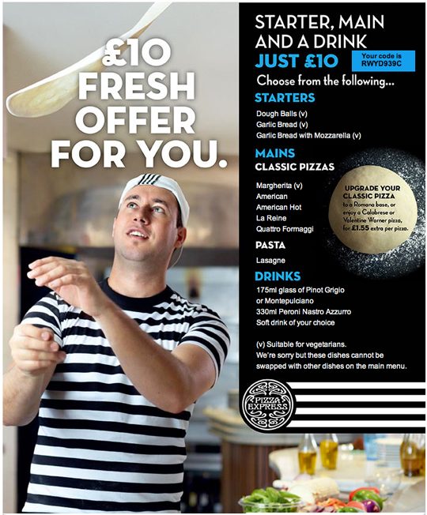
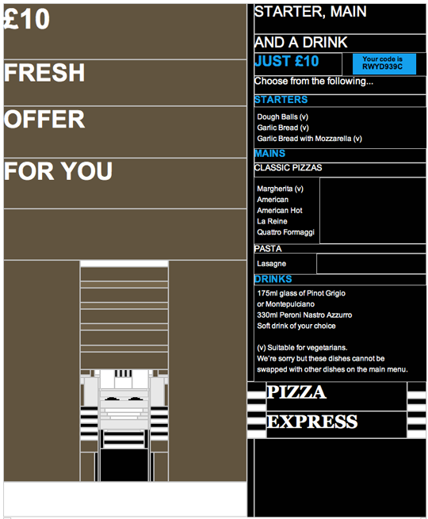

Ondanks pogingen om een [universele
standaard](http://www.email-standards.org/) voor e-mail op te stellen,
wijkt de manier waarop verschillende e-mailclients html-mails tonen nog
wel eens van elkaar af. Vervelend voor e-mailmarketeers, die daarom
misschien in de verleiding komen om hun hele e-mailing maar uit één
grote of meerdere afbeeldingen te laten bestaan, zodat de zorgvuldige
opgestelde layout niet verloren gaat.

Dat lijkt misschien een logische oplossing, maar is absoluut geen goed
idee. Te veel afbeeldingen en te weinig tekst in je e-mailings is
namelijk een beproefde manier om je
[e-maildeliverability](./deliverability-hogere-e-mailaflevering-met-copernica.md)
te schaden. Bovendien tonen veel e-mailclients afbeeldingen standaard
alleen als de ontvanger er voor kiest . Door alleen afbeeldingen in je
e-mail op te nemen is het voor de ontvanger dan dus volstrekt
onduidelijk waar het bericht over gaat.

Ga er liever vanuit dat afbeeldingen in e-mails standaard niet worden
geladen, en neem de volgende maatregelen om ervoor te zorgen dat het
voor ontvangers zelfs zonder afbeeldingen duidelijk is wat de boodschap
van je e-mail is.

Zes tips om  voor effectieve e-mails, ook als afbeeldingen niet worden
getoond:

**1. Gebruik alt-tekst**

Vergeet nooit een alt-tekst voor je afbeeldingen op te nemen in je
html-code. Gebruik voor je
[call-to-actions](./verbeter-je-call-to-action-in-e-mailcampagnes.md)
dezelfde tekst als in de afbeelding staat. Vergeet ook niet je
call-to-actions ook in gewone tekst in je e-mail op te nemen, voor het
geval de client ook geen alt-teksten toont.

**2. Specificeer de hoogte en breedte van je afbeeldingen**

Als afbeeldingen in je e-mails niet laden is dat één ding, maar als je
de afbeeldingsformaten niet specificeert kunnen afbeeldingen die niet
laden ook de rest van je layout verpesten.

Geef daarom altijd de breedte en hoogte van je afbeeldingen mee in de
img-tag in je html code.

**3. Geef een html-alternatief**

Hoe ziet je e-mail eruit als afbeeldingen niet worden geladen? Een
Britse restaurantketen die een [foto van een
pizzabakker](https://litmus.com/blog/pizzaexpress-inspires-with-images-off-email-optimization)
in haar e-mailings opnam, besloot de html-tabellen zo in te richten dat
de man in het gestreept shirt altijd zichtbaar was. Ongeacht of
afbeeldingen laden of niet.

De e-mail met afbeeldingen: \

De e-mail zonder afbeeldingen: \

Maar wie een beetje creatief is kan ook met minder moeite het wegvallen
van afbeeldingen gemakkelijk opvangen. Het verdwijnen van een blauwe
button kun je bijvoorbeeld opvangen door een blauwe tabel in je template
op te nemen, waarin je in ‘normale’ tekst een call-to-action opneemt,
een zogenaamde ‘bulletproof’ button. Online zijn [handige
tools](http://emailbtn.net/) te vinden waarmee je deze buttons makkelijk
zelf maakt.

**4. Zorg dat je boodschap al boven de vouw zichtbaar is**

Door je boodschap (en dan vooral de call-to-action) in de body-tekst al
boven de vouw (waar de rand van het beeldscherm begint) te plaatsen, ben
je er zeker van dat mensen hem meekrijgen, of afbeeldingen nou laden of
niet.

Plaats deze dus altijd bovenin, en
[test](./test-voor-je-verzendt.md)
of de tekst zonder scrollen zichtbaar is in verschillende e-mailclients.
Vergeet daarbij niet dat veel mensen e-mails lezen op hun mobiele
telefoon.

**5. Plaats altijd een link naar de webversie van je e-mail**

Er is maar een plek waar je het al-dan-niet tonen van je
e-mailafbeeldingen volledig in eigen hand hebt: de webversie van je
e-mailing. Omdat gebruikers deze openen in hun webbrowser, hoef je je
hierbij geen zorgen te maken om gebroken afbeeldingen. Neem in je
e-mails dus altijd een tekstlink op naar de
[webversie](./linken-naar-de-webversie-van-een-e-mail.md),
en plaats deze op een prominente plaats bovenaan in je document.

**6. Stuur altijd een tekstversie van je e-mail mee**

Sommige e-mailclients kunnen niet eens html-mails lezen, laat staan
afbeeldingen tonen. Vergeet daarom niet altijd een tekstversie van je
e-mailings mee te sturen! \
[Dit artikel verscheen eerder op
Emerce.nl](http://www.emerce.nl/achtergrond/hoe-zien-jouw-emails-uit-zonder-afbeeldingen)
