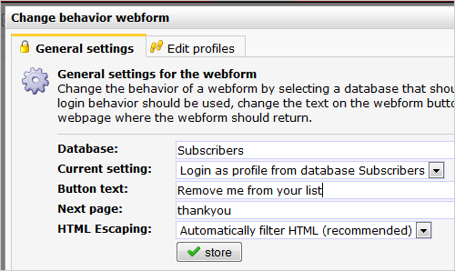
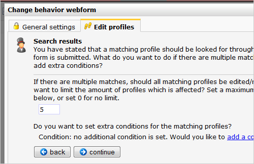

Wanneer iemand zich afmeld voor een nieuwsbrief, hoef je zijn of haar
gegevens natuurlijk niet te bewaren. Dit artikel laat stap voor stap
zien hoe je een dergelijk afmeldformulier maakt.

Let op: wanneer je de
[{unsubscribe}](./de-uitschrijflink-unsubscribe-tag.md)
link gebruikt in je emailings, dan hoef je hiervoor geen webformulier te
gebruiken, maar stel je dit in bij het
[uitschrijfgedrag](./uitschrijfgedrag-instellen-op-database-of-collectie.md)
op de database of collectie.

Het webformulier maken
----------------------

-   Maak in het onderdeel **Content** een nieuw webformulier en koppel
    deze aan de database of collectie waaraan je de nieuwsbrief
    verstuurt.
-   Je hebt in dit formulier slechts 1 veld nodig: het e-mailveld. Maak
    dit veld een **sleutelveld**.
-   Sla het veld op en ga naar de **webformulier instellingen**
-   Kies bij **algemene instellingen**de instellingen zoals hieronder
    weergegeven. Ga vervolgens naar het tabblad **Profielen bewerken**

-   Kies in de eerste stap dat het formulier werkt met alle profielen
    die overeenkomen met de sleutelvelden.
-   Als er meerdere matches zijn (het kan gebeuren dat het e-mailadres
    dubbel voorkomt in de database), dan moeten ze allemaal worden
    verwijderd.\
     Vul daarom bijvoorbeeld een 5 in (lijkt ons een veilige marge).

-   Ga verder naar de volgende stap, en kies hier dat het profiel moet
    worden **verwijderd**.
-   Klik wederom op **Verder** om de wizard af te ronden.
-   Controleer de gekozen instellingen, en klik op Afronden als je
    tevreden bent.

Het webformulier zal nu werken. Plaats het in een webpagina met de
hiervoor bedoelde tag:

`{webform name="name of your form"}`

Test het formulier voordat je het gaat gebruiken in je campagne(s).
