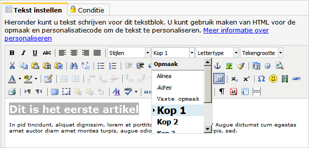
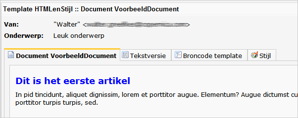
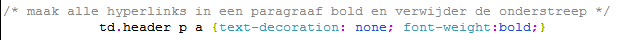
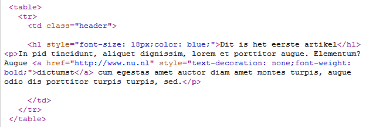

# CSS automatisch omzetten naar inline HTML

De meeste e-mailprogramma’s negeren de CSS styles die in de header of in
een extern stylesheet zijn gedefinieerd. Het vervelende hiervan is dat
je voor ieder HTML element apart de weergave zou moeten definiëren (door
het toevoegen van een *style=* attribuut aan de HTML tag). Hartstikke
onhandig natuurlijk, zeker wanneer je een omvangrijke template hebt
waarop je nog omvangrijkere e-maildocumenten bouwt.

De software beschikt gelukkig over een functie waardoor je gebruik kan
blijven maken van een extern stylesheet. Wanneer je dit stylesheet via
de applicatie koppelt aan de template of document, worden alle
stijlregels uit de stylesheet vlak voor het versturen van het document
automatisch omgezet naar inline style attributen.

Bijkomend voordeel is dat je ook HTML-elementen die binnen een tekstblok
worden gebruikt van stijlregels kunt voorzien, zonder dat de
eindgebruiker van het document zich hoeft te bekommeren om de
achterliggende code.

Wanneer de eindgebruiker een titel toevoegt, kan deze dus automatisch de
opmaak krijgen die in het stijldocument is gedefinieerd, ook al bevindt
deze titel zich in een tekstblok.

Voorbeeld: alle headers in een tekstblok opmaken
------------------------------------------------

In het volgende voorbeeld doen we uit de doeken hoe je alle H1-tags (dus
HTML titel-tag) binnen in een tekstblok automatisch dezelfde weergave
kunt geven door middel van een gekoppeld stylesheet. Bij het verzenden
van de e-mail zet de applicatie de block style elementen automatisch om
naar inline style attributen.

Ter voorbereiding heb je nodig:

-   Een e-mailtemplate en –document met hierin een tekstblok
-   Een leeg of bestaand stylesheet. Deze maakt u aan in het onderdeel
    ‘Stijl’ en koppelt u aan de template via het template menu \>
    **Stijl koppelen.**\

Open het e-maildocument waaraan je de stijlregels wilt koppelen.\
 We beginnen in het bovenliggende template (klik op het tabblad
‘**broncode template**’). Daar voeg je een ‘class’ attribuut aan het
HTML-element dat de tekstblok bevat (met een class attribuut verwijst je
naar een regel uit een stylesheet). In het voorbeeld geven we de
tabel-cel (td) de class ‘header’.

Vervolgens kan je in een extern stylesheet de class ‘header’ de
eigenschap geven dat de lettergrootte altijd 16 pixels moet zijn. Koppel
de stylesheet aan de template via het template menu \> **Stijl
instellen**. Selecteer uw stylesheet en de optie ‘stijlblokken vervangen
door inline attributen’. Klik op opslaan.

Boven het document is nu het nieuwe tabblad ‘Stijl’ verschenen. Open het
tabblad en voer de volgende regel in:

`td.header h1 {font-size:16px; color:blue;}`

-   *td* refereert aan de tabel cel uit de template
-   *.header* refereert aan de class ‘header’ die we aan de td-tag in de
    template hebben toegevoegd.
-   *h1* refereert aan de HTML header tag

Ga naar het tabblad document en klik op het tekstblok om deze te
bewerken (als je geen aanklikbaar tekstblok ziet, klik dan
op**Bewerkmodus**linksonder het document)

Typ een header, en kies **Kop 1** uit het opmaak menu.

Sla de wijzigingen op en sluit het dialoogvenster.

Ga terug naar **voorbeeldweergave**. De header zal nu 16 pixels zijn en
een mooie blauwe letter hebben.

Op dezelfde wijze kan je bijvoorbeeld alle hyperlinks in een paragraaf
opmaken:

En zo ziet de broncode eruit van het document als u deze als e-mail
heeft verzonden. De titel heeft de eigenschappen gekregen die u aan de
class header heeft gegeven. De hyperlink in de paragraaf is vetgedrukt
en is niet onderstreept.

