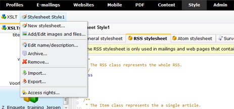

Copernica biedt de mogelijkheid om stylesheets centraal te beheren en te
gebruiken voor je publicaties. Je beheert je stylesheets in het
onderdeel Stijl.

Nadat je een bestaande stylesheet hebt geselecteerd in de lijst, worden
diverse beheerfuncties geactiveerd in het Stijlsheet menu.

Nieuwe stylesheet aanmaken
--------------------------

Onder *Stijl*kan je stylesheets aanmaken vanuit het gelijknamige menu.

Geef het stylesheet een duidelijke naam (geen bijzondere tekens) klik op
*opslaan*. De stylesheet is algemeen en kun je later opdelen in
stylesheets voor algemeen, RSS, Atom, enquetes en webformulieren.

Elke nieuwe stylesheet wordt voorzien van voorbeeldcode. Deze is gelijk
aan de standaardopmaak van de publicaties. Deze kan je als basis
gebruiken voor jouw eigen stylesheet.

Stylesheet hernoemen
--------------------

Een stylesheet kan je hernoemen vanuit het Stijlsheet menu. Het
hernoemen heeft geen invloed op de publicaties die reeds gebruik maken
van de stylesheet.

Stylesheet verwijderen
----------------------

Wanneer je niet langer gebruik maakt van een stylesheet, kan je deze
verwijderen vanuit het *Stylesheet*menu.

Een verwijderde stylesheet is definitief weg; het is dus niet meer terug
te halen.

Publicaties met deze stylesheet worden mogelijk niet meer correct
weergegeven. Indien je twijfelt of het stylesheet nog wordt gebruikt
voor een publicatie, kan je de sheet beter archiveren.

Bij het verwijderen van een stylesheet vraagt de software altijd om een
dubbelcheck.

Stylesheet archiveren
---------------------

Een stylesheet die je niet actief meer gebruikt, kan worden
gearchiveerd. Het bestand verdwijnt dan uit de lijst van actieve
stylesheets. Hierdoor blijft de stylesheet bewaard, maar houd je
overzicht op actieve bestanden.

Publicaties blijven gebruik maken van een gearchiveerde stylesheet.
Gearchiveerde stylesheets blijven beschikbaar vanuit het tabblad
*Gearchiveerd*, en kunnen te allen tijde worden gedearchiveerd.

Stylesheet importeren
---------------------

Een stylesheet die je buiten de applicatie hebt gemaakt kan je
importeren naar het onderdeel Stijl via de functie *stylesheet
importeren*.

Maak eerst een lege stylesheet aan, en kies vervolgens voor
*Importeren*om het .CSS bestand of .ZIP bestand te importeren.

Het is natuurlijk ook mogelijk om de inhoud van een stylesheet te
kopiëren/plakken naar een leeg stylesheet.

Stylesheet exporteren
---------------------

Een stylesheet in de marketing software kan je exporteren naar je eigen
computer via de functie 'stylesheet exporteren' onder Stijl.
