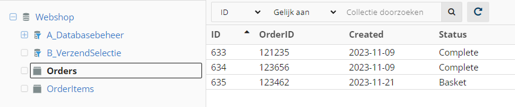
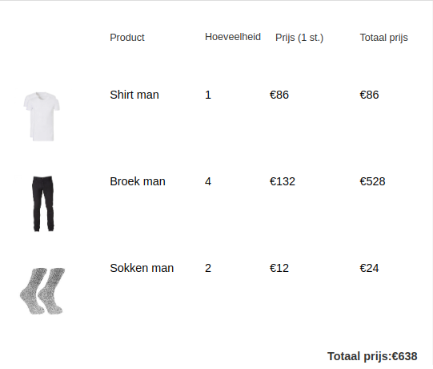

# Verlaten Winkelwagen #
De verlaten winkelwagencampagne is een e-mail of een reeks e-mails die je stuurt naar klanten die hun winkelmandje achtergelaten hebben. Het doel van deze campagne is om de klant te stimuleren om alsnog over te gaan tot een aankoop.
Uit een onderzoek van [Fresh Relevance](https://www.freshrelevance.com/resources/real-time-marketing-report-for-q3-2018) blijkt dat 57% van de winkelwagentjes verlaten achterblijft en uit [een overzicht van 41 onderzoeken](https://baymard.com/lists/cart-abandonment-rate) blijkt dat dit cijfer zelfs kan oplopen tot 81.40%. Hierdoor wordt er jaarlijks veel omzet misgelopen. Het goede nieuws is dat er een manier is om een deel van deze gemiste omzet toch binnen te halen

In dit artikel wordt een een campagne opgesteld die ingezet wordt bij een verlaten winkelmandjes. We gaan hierbij uit van een werkende integratie tussen de webshop en Copernica, waarbij de lege winkelmandjes dus reeds in een database in Copernica te vinden zijn. Hieronder zie je enkele afbeeldingen van onze demo webshop.

Hier is een profiel met zijn subprofielen in collectie 'Orders' zichtbaar. In deze collectie staan alle orders, de bijbehorende producten staan in collectie 'OrderItems'. Deze scheiding wordt gemaakt om de losse producten te kunnen groeperen op basis van het ID van de order.




Dit is collectie 'OrderItems', waarin de losse producten staan. In veld 'OrderID' staat het ID van de order zoals we die in 'Orders' vinden. Verder staat de prijs en een locatie van een afbeelding van het product in het subprofiel.


## Het document ##

Nu we de basis van de e-mail campagne hebben gebouwd, is het tijd om het document op te gaan bouwen. De motor achter het document is de [loadsubprofile](./loadprofile-and-loadsubprofile.md)-functie, waarmee subprofielen uit de database opgehaald kunnen worden (en ook uit andere databases dan die waar het geadresseerde profiel in zit).

### Subprofielen laden met loadsubprofile ###
Allereerst halen we het meest recente orders met status basket uit collectie 'Orders'. Hiervoor vragen we met behulp van <em>loadsubprofile</em> de subprofielen uit de collectie op, waarbij we de <em>limit</em> op 1 zetten en we (omgekeerd) sorteren op de veld 'Timestamp'. Vervolgens zeggen we dat het veld Status gelijk moet zijn aan basket, we willen namelijk geen complete orders tonen. 
De code:

```

{loadsubprofile source="Webshop:Orders" profile=$profile.id assign=Order multiple=false Status="Basket" limit=1 orderby='Timestamp desc'}


```

Vervolgens halen we alle door dit profiel achtergelaten producten uit de collectie 'OrdersItems'. Om te zorgen dat we alleen de juiste orders ophalen gebruiken het bijbehorende OrderID. Daarnaast gebruiken we nu de parameter <em>multiple</em> om aan te geven dat we meerdere (alle!) subprofielen willen.:

```

{loadsubprofile source="Webshop:OrderItems" profile=$profile.id OrderID=$Order.OrderID assign=loadedProducts multiple=true}

```

### Een loop met foreach ###
Nu begint het echte werk. We gaan iteratief door alle opgehaalde subprofielen lopen, waarbij we ze netjes laten zien in een tabel en we de totale prijs van het mandje telkens optellen. Het doorlopen van alle subprofielen gebeurt met <em>foreach</em>. De code om dit te controleren en om alleen bij de juiste subprofielen de naam van het product te laten zien is als volgt:

```

{foreach from=$loadedProducts item=loadedProduct} 
    {$loadedProduct.Product} 
  {/if} 
{/foreach}


```

*N.B. Als je een link naar de pagina van het product wilt opnemen in je document, dan zul je die ook in de for-each moeten laten zien. Het is dan vereist om &lt;code&gt;-tags te gebruiken. Bijvoorbeeld: &lt;code&gt;{$loadedProduct.Url}&lt;/code&gt;. *

### Prijs per product ###

Het is voor de klant natuurlijk prettig om een zo compleet mogelijke weergave van z'n winkelmandje te krijgen. In de database staat voor elk product welk aantal ervan in het winkelmandje zijn achtergelaten. Ook staat de prijs per stuk in de database. We bereken de totaalprijs door met [math equation](./publisher-personalization-functions#math) de hoeveelheid met de prijs te vermenigvuldigen. We willen dat graag in het document laten zien:

```

{foreach from=$loadedProducts item=loadedProduct} 
     {$loadedProduct.ProductNaam} 
     {$loadedProduct.Hoeveelheid} 
     {$loadedProduct.Prijs} 
     {capture assign="ProductTotaal"}{math equation="x*y" x=$loadedProduct.Hoeveelheid y=$loadedProduct.Prijs}{/capture}
{/foreach}


```
### Totaalprijs ###

Om onderaan een totaalprijs van het gehele winkelmandje te kunnen plaatsen, maken we bovenaan in het document een variabele <em>basketTotal</em> aan welke we in de <em>foreach-loop</em> verhogen met de totale prijs van het product.


Buiten de <em>foreach-loop</em>:
```

{capture assign="basketTotaal"}0{/capture}


```

In de <em>foreach-loop</em> en het <em>if-statement</em>:

```

{assign var="basketTotaal" value=$basketTotaal+$productTotaal} 


```


### Het complete document ###


Voor de overzichtelijkheid is het verstandig om het mandje in een tabel weer te geven. Door al het bovenstaande samen te voegen en in een tabel te zetten ontstaat de volgende code:

```

<table  align="center" width="600px">
    <tr align="left"><th></th><th>Product</th><th >Hoeveelheid</th><th >Prijs (1 st.)</th><th>Totaal prijs</th></tr>

    {capture assign="basketTotaal"}0{/capture}
  
    
	{loadsubprofile source="Webshop:Orders" profile=$profile.id assign=Order multiple=false Status="Basket" limit=1 orderby='Timestamp desc'}
      

	{loadsubprofile source="Webshop:OrderItems" profile=$profile.id OrderId=$Order.OrderID assign=loadedProducts multiple=true}
  	{foreach from=$loadedProducts item=loadedProduct}    
    		<tr>
       			<td>
            		 
          		</td>
          		<td>
      				{$loadedProduct.ProductNaam}
          		</td>
          		<td>
            		{$loadedProduct.Hoeveelheid}
          		</td>
          		<td>
          		  €{$loadedProduct.Prijs}
         		</td>
         		<td>
         		   	{capture assign="productTotaal"}{math equation="x*y" x=$loadedProduct.Prijs y=$loadedProduct.Hoeveelheid}{/capture}
            		€{$productTotaal}
          		</td>
              <br/>
        	</tr> 
    
		    {assign var="basketTotaal" value=$basketTotaal+$productTotaal}
 
  	{/foreach}
  
    <tr><td></td><td></td><td></td>
    	<td><b>Totaal prijs:</b></td><td><b>€{$basketTotaal}</b>
    </td></tr>
      
</table>
```

### Het resultaat ###



## De opvolgactie ##
Naast dat je document automatisch gevuld wordt, willen we ook dat de mailing automatisch verstuurd wordt. Dit doen we aan de hand van een opvolgactie. De opvolgactie wordt ingesteld op database, waarin we controleren of de status naar Basket is veranderd, vervolgens wacht de opvolgactie de aangegeven tijd. Na deze tijd controleren we nog eenmaal of de order nog steeds status Basket heeft en dan versturen we de mailing. Hieronder wordt stapsgewijs uitgelegd hoe je deze aanmaakt. 

### Instellen

 - Ga naar Profielen
 - Selecteer de database en klik op de opvolgactie tab
 - Klik op de collectie Orders en maak een nieuwe opvolgactie aan
 - Kies als aanleiding dat een subprofiel is aangemaakt of gewijzigd en kies het veld Status en de waarde Basket
 - Als Actie kies je verstuur een opgemaakt document per e-mail en stel de wachtijd in
 - Kies vervolgens het verlaten winkelwagen document en als bestemming het profiel zelf
 - Stel als laatst op de actie een conditie in die checkt of het veld Status gelijk is aan Basket
