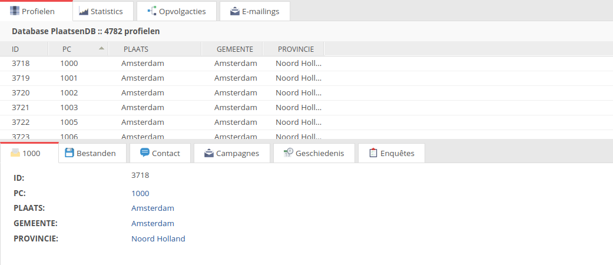
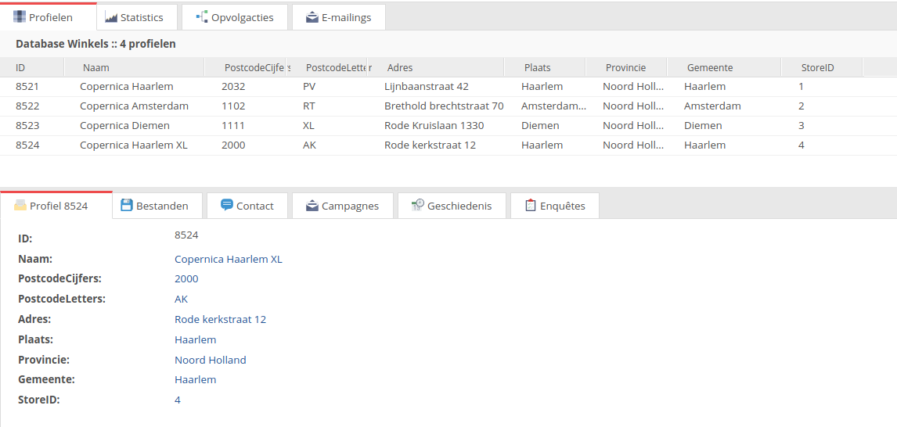

# Geotargeting

Geotargeting kan gebruikt worden om klanten uit een speciefieke regio aan te spreken of de inhoud van de mail kan erop aangepast worden. 
Het doel is om met geotargeting nog meer gericht te mailen. In onze [campagne uitgelicht blog](https://www.copernica.com/nl/blog/post/campagne-uitgelicht-editie-3-geotargetingcampagnes) bespreken we een aantal toepassingen van geotargeting.
In onderstaand artikel wordt uitgelegd hoe geotargeting mogelijk is in Copernica. 

## Postcodes

Een van de beste manieren om de locatie van een klant te bepalen is van de postcodes. 
Deze hebben namelijk een logische structuur om plaatsen te herkennen, via de nummers van een postcode kan je eenvoudig
de plaats erbij vinden. Postcodes 1000-1100 zijn bijvoorbeeld regio Amsterdam. 


  - Voor geotargeting kunnen we een lijst gebruiken waarbij alle postcodes aan plaatsen en provincies gekoppeld zijn, download deze lijst [hier](../downloads/geotargeting.csv).
 - Vervolgens importeren we deze lijst in een nieuwe database. Deze database noemen we **PlaastenDB**.
 - Gebruik voor de veld namen de namen uit de import. 
 - Na de import zou de database er als onderstaande moeten uitzien:
 
 
 
Deze database gaan we straks gebruiken om meer informatie uit de postcodes te halen.

### Selectie op basis van locatie

De meest eenvoudige manier van geotargeting kan dus gedaan worden op postcode. We kunnen met een selectie alle klanten uit een bepaalde regio selecteren door een postcode range op te geven. Dit doen met een zogenoemde [reguliere expressie](https://regex101.com/), hiermee kunnen we een range aangeven waar alle postcode in moeten vallen. Er wordt alleen gekeken naar de cijfers want de letters geven enkel straten aan en geen steden. De reguliere expressie voor amsterdam ziet er als volgt uit:

```

/[1][0][0-9][0-9].*/

```

Er zitten 4 cijfers in een postcode daarom staan er 4 sets aan blokhaken, elke set van blokhaken staat voor een nummer van de postcode. De postcodes van Amsterdam liggen tussen 1000-1099, kortom de eerste 2 cijfers staan vast. Het eerste cijfer is altijd een 1 oftewel [1] en het tweede cijfer is altijd een 0 oftewel [0]. De volgende cijfers liggen ergens tussen 0 en 9 oftewel [0-9]. De punt en de astriks zorgen ervoor dat letters van de postcode genegeerd worden. 


 - Om hiermee een selectie te maken, maken we vervolgens een conditie aan die checkt op veldwaarde.
 - Kies het postcode veld en geef als vergelijking **voldoet aan reguliere expressie**.
 - Vul bij waarde de bovenstaande reguliere expressie in en je hebt nu een selectie die iedereen uit regio Amsterdam selecteert. 
 
 ## Winkels
 
 Naast dat je wil bepalen wil je natuurlijk ook weten welke winkel de dichtstbijzijnde is per klant. We kunnen dit handmatig doen of doormiddel van smarty. Eerst zal de handmatige uitgelegd worden om het concept te snappen en zal daarna dieper op de automatische variant ingegaan worden. 
 
### Winkel Database

De eerste stap is een database aanmaken waar al onze winkels in staan. Hierin zet je alle informatie die je wilt tonen in je email, denk hierbij aan adres, url naar een foto en een beschrijving. Het is aan te raden om postcode te splitsen in cijfers en letters, dit is voor een check bij de mailing straks handig. De onderstaande afbeelding geeft een voorbeeld van een Winkel database:


 
 Maak een veld **StoreID** aan, dit veld bevat de waarde die uniek is per winkel. Dit kan prima een simpel cijfer zijn maar kan ook een winkel id zijn. We willen dat deze waarde ook bij het profiel komt te staan, zodat bekend is welke winkel het dichtstbij is. Dit doen we als volgt
 
 
 - Maak een veld **Winkel** aan in je klantendatabase.
 - Zorg dat je een selectie hebt waarin alle profielen uit een bepaalde regio van de winkel vallen.
 - Ga naar Huidige weergave > Meerdere profielen wijzigen/verwijderen en geef alle profielen uit deze selectie de juiste StoreID in het veld Winkel
 -  Hierdoor kunnen we altijd in het profiel terugvinden wat de dichtsbijzijnde winkel is. 
 
 ### Winkel informatie in mailings
 
 De volgende stap is de winkel informatie tonen in een mailing, voor nu gaan we er even vanuit dat alle profielen een gelabelde winkel hebben in het veld Winkel. We willen de gelabelde winkel tonen aan de hand van het profiel, echter staat deze in een andere database. Dit kunnen we doen door de functie [loadprofile]./loadprofile-and-loadsubprofile) te gebruiken, hiermee kunnen we profielen uit een andere database inladen. Met onderstaande code kan de juiste winkel ingeladen worden vanuit ons voorbeeld:
 
 ```
 
 {loadprofile source="Winkels" StoreID=$Winkel assign="opgehaaldeWinkel"}
    
 De winkel is gevonden en is {$opgehaaldeWinkel.Naam} {$opgehaaldeWinkel.PostcodeCijfers} {$opgehaaldeWinkel.Plaats} 
 
 ```
 
 Hierbij is Winkels onze winkel database en wordt het veld Winkel gekoppeld aan het veld StoreID, hierdoor wordt alleen de juiste winkel opgehaald uit de database. Dit geeft als resultaat:
 
 ```
 
 De winkel is gevonden en is Copernica Amsterdam 1102 Amsterdam Zuidoost

 ```
 
 ### Automatische winkel informatie
 
 De eerder genoemde stappen vereisen wat handwerk om de juiste persoon aan een winkel te koppelen. Hieronder wordt een methode beschreven hoe dit ook automatisch kan. Hiervoor berekenen we de dichtsbijzijnde winkel aan de hand van de postcode, we gaan er in dit senario vanuit dat de dichtsbijzijnde postcode ook de dichtsbijzijnde winkel is. Hiervoor worden meerdere stukken code gebruikt, deze zullen in delen uitgelegd worden en aan het einde van dit artikel staat de volledige code. 
 
 
 De eerste stap is alleen de cijfers van de postcode te gebruiken, hiervoor gebruiken we [truncate](./personalization-modifiers#truncate) om de eerste 4 waardes te selecteren. Daarnaast hebben we 2 variable nodig, de variable **kortsteAfstand** om de afstand tot de postcode te bereken en de variable **besteWinkel**, deze bevat uiteindelijk de dichtsbijzijnde winkel. 
 
 ```
 
<!-- Haal de letters van de postcode af -->
{capture assign="postcodeCijfers"}{$profile.Postcode|truncate:4:""}{/capture}
    
<!-- Variable om de afstand op te slaan -->
{assign var = "kortsteAfstand" value=100000}
    
<!-- Variable die uiteindelijk de juiste winkel bevat -->
{assign var = "besteWinkel" value=""}
 
 ```
 
 Vervolgens laden we meer informatie in over de postcode door loadprofile te gebruiken op de **PlaatsenDB**. Deze wordt toegewezen aan variable locatie, hieruit kunnen we alles over de locatie opvragen. Daarnaast willen we alle winkels ophalen waarvan de postcode cijfers matched met de postcode cijfers van een winkel. De kans hierop is echter vrij klein omdat de cijfers exact moeten matchen:
 
```

<!-- Laat meer informatie uit via postcode op uit de PlaatsenDB -->
{loadprofile source="PlaatsenDB" PC=$postcodeCijfers assign="locatie"}

<!-- Haal alle winkels op met dezelfde postcode als het profiel -->
{loadprofile source="Winkels" PostcodeCijfers=$postcodeCijfers assign="winkel"}
 
 ```
 
 Vervolgens checken we of deze winkel bestaat als dit het geval is dan wordt dit de beste winkel zo niet dan kijken we verder. 
 
 
 ```
 
<!-- Check of de winkel in dezelfde postcode bestaat -->
{if $winkel}

  <!-- Zet deze winkel als beste winkel -->
  {$besteWinkel = $winkel}
 
 ```
 
 Als de winkel niet gevonden wordt dan er gezocht op plaats. Als er een plaats gevonden wordt dan zijn er twee opties, er zijn meerdere winkels in de plaats of er is maar 1 winkel in de plaatst. Als dat tweede het geval is dan wordt deze winkel automatisch de beste winkel. Als er meerdere winkels zijn dan berekenen we met [math equation] het verschil tussen de postcodes uit. De winkel met het laagste verschil wordt dan 
 
 ```
 
 <!-- Haal alle winkels op met dezelfde plaats als het profiel -->
   {loadprofile source="Winkels" Plaats=$locatie.PLAATS assign="winkel" multiple="true"}
    
      <!-- Check of de winkel in dezelfde plaats bestaat -->  
            {if $winkel}
       <!-- Check of er meerdere winkels in de plaats zijn -->
                {if $winkel|count > 1}
                    {foreach $winkel as $store}
      
         <!-- Bereken het verschil tussen de postcodes-->
                  {capture assign="verschil"}{math equation="abs(x-y)" x=$postcodeCijfers y=$store.PostcodeCijfers}{/capture}
    
         <!-- Kijk of de nieuwe afstand korter is --> 
                        {if $verschil lt $kortsteAfstand}
    
                           {$kortsteAfstand = $verschil}
          <!-- Zet deze winkel als beste winkel -->
                           {$besteWinkel = $store}

                       {/if}         
 
            {/foreach}
            
         {else}
    
         {foreach $winkel as $store}
      <!-- Zet deze winkel als beste winkel -->
            {$besteWinkel = $store}
    
         {/foreach}
    
    {/if}
 
 ```
 
 
 ```
 
 <!-- Haal de letters van de postcode af -->
    {capture assign="postcodeCijfers"}{$profile.Postcode|truncate:4:""}{/capture}
    
    <!-- Variable om de afstand op te slaan -->
     {assign var = "kortsteAfstand" value=100000}
    
    <!-- Variable die uiteindelijk de juiste winkel bevat -->
     {assign var = "besteWinkel" value=""}
    
    
     <!-- Laat meer informatie uit via postcode op uit de PlaatsenDB -->

    {loadprofile source="PlaatsenDB" PC=$postcodeCijfers assign="locatie"}
    
    <!-- Haal alle winkels op met dezelfde postcode als het profiel -->
    {loadprofile source="Winkels" PostcodeCijfers=$postcodeCijfers assign="winkel"}
    
    
    <!-- Check of de winkel in dezelfde postcode bestaat -->
    {if $winkel}
    
      <!-- Zet deze winkel als beste winkel -->
      {$besteWinkel = $winkel}
    
    {else}
    
     <!-- Haal alle winkels op met dezelfde plaats als het profiel -->
   {loadprofile source="Winkels" Plaats=$locatie.PLAATS assign="winkel" multiple="true"}
    
      <!-- Check of de winkel in dezelfde plaats bestaat -->  
            {if $winkel}
       <!-- Check of er meerdere winkels in de plaats zijn -->
                {if $winkel|count > 1}
                    {foreach $winkel as $store}
      
         <!-- Bereken het verschil tussen de postcodes-->
                  {capture assign="verschil"}{math equation="abs(x-y)" x=$postcodeCijfers y=$store.PostcodeCijfers}{/capture}
    
         <!-- Kijk of de nieuwe afstand korter is --> 
                        {if $verschil lt $kortsteAfstand}
    
                           {$kortsteAfstand = $verschil}
          <!-- Zet deze winkel als beste winkel -->
                           {$besteWinkel = $store}

                       {/if}         
 
            {/foreach}
      {else}
    
         {foreach $winkel as $store}
      <!-- Zet deze winkel als beste winkel -->
            {$besteWinkel = $store}
    
         {/foreach}
    
    {/if}
    
    {else}
    
     <!-- Haal alle winkels op met dezelfde provincie als het profiel -->
      {loadprofile source="Winkels" Provincie=$locatie.PROVINCIE assign="winkel" multiple="true"}
      
            {foreach $winkel as $store}
    
        <!-- Bereken het verschil tussen de postcodes-->
            {capture assign="verschil"}{math equation="abs(x-y)" x=$postcodeCijfers y=$store.PostcodeCijfers}{/capture}
               
       <!-- Kijk of de nieuwe afstand korter is --> 
       {if $verschil lt $kortsteAfstand}
                 
        {$kortsteAfstand = $verschil}
    
        <!-- Zet deze winkel als beste winkel -->
                  {$besteWinkel = $store}

                {/if}         
 
            {/foreach}
      
    {/if}
    
    {/if}
   
    De winkel is gevonden op provincie {$besteWinkel.Naam} {$besteWinkel.PostcodeCijfers}  {$besteWinkel.Plaats} 
    
 
 ```
 

 
