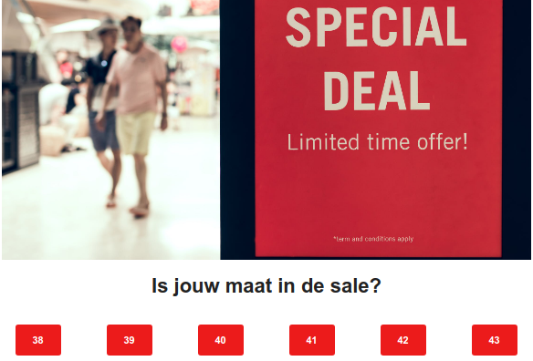

# Profielverrijking 
Profielverrijking is een proces waarbij je een klant steeds beter leert kennen. In principe stel je voor iedere klant een gedragsprofiel op in je database die in de loop der tijd uitgebreid wordt met nieuwe informatie. Op basis van deze informatie kan je vervolgens persoonsgerichte campagnes uitsturen. 

De sleutel tot succesvolle e-mailcampagnes is relevantie. Als je alleen een naam en e-mailadres hebt van de klant is het echter moeilijk om te bepalen wat nu precies ‘relevant’ voor hen is, daarom is het verzamelen van gegevens zo belangrijk. Bij profielverrijking vergaar je steeds meer gegevens van de ontvanger als gevolg van een actie vanuit de verzender. Hieronder leggen we uit hoe je profielverrijking in Copernica kan instellen, deze concepten worden verder uitgelegd in onze [profielverrijkings blog](https://www.copernica.com/nl/blog/post/campagne-uitgelicht-1-leer-je-klant-beter-kennen-met-profielverrijking).

## Profielverrijking via webformulieren
De meeste nieuwe klanten zullen binnenkomen via een webformulier of via een automatische koppeling. Voor dit voorbeeld gaan we even van het eerste uit. Er zijn twee manieren in Copernica om een webformulier aan een database te koppelen. Je kan een HTML formulier genereren en deze op je eigen website plaatsen of je maakt een webformulier in Copernica en zet deze op een Copernica landingspagina. 

#### Formulier genereren 
Voor een **aanmeld** of **wijzig formulier** ga je **Websites** in de **Publisher**.
- Ga naar **Webpagina [NAAM]** en klik in het menu op **Formulier genereren**
- Kies **Aanmeldformulier** of **Wijzig formulier** en kies de database waar de nieuwe profielen ingezet worden  
- Kies in het volgende venster welke velden ingevuld moeten worden. Je kan hier ook een sleutelveld aangeven, waardoor je geen dubbele profielen in je database krijgt.
- Het is mogelijk om na het invullen van het formulier direct een mail te sturen. Deze kan je in het volgende venster als opvolgactie instellen. Deze [mail](./campaign-profile-enrichment#vervolgmail) wordt later in dit artikel toegelicht. 
- Voeg in het volgende venster een bedankpagina, captcha, etc toe
- Het laatste venster toont het HTML formulier. Dit formulier kan je nu op je eigen website plaatsen. 

**Tip**: om data direct naar de database te sturen zonder deze te vragen kan je het input veld hidden maken en gelijk de juiste waarde geven. 

```
<td>SingleOptin</td>
<td><input type="hidden" value=”Ja” name="dbfield49"/></td>
```

#### Webformulier
Op de volgende [pagina](./create-and-publish-a-webform) wordt beschreven hoe je een webforumlier aanmaakt in Copernica. Dit webformulier moet op een Copernica landingspagina staan. Deze pagina kan je inladen als iframe op je eigen website of hier naar toe linken vanuit een mailing. 

#### Vervolgmail
Nadat een klant zich heeft aangemeld voor de nieuwsbrief wil je een vervolgmail sturen. Deze mail kan een link bevatten naar een pagina waar een klant zijn/haar voorkeuren kan aangeven. Dit is een Copernica of eigen landingspagina met een formulier erop. Om te zorgen dat de data goed verwerkt kan worden dien je de volgende link te gebruiken.

```
http://jouwdomein.nl/websitepagina?profile={$profile.id}&code={$profile.code}
```
{$profile.id} zorgt ervoor dat het formulier weet welk profiel aangepast moet worden en {$profile.code} is een code die wij gebruiken ter verificatie. Let hierbij op dat het formulier een wijzigingsformulier is met sleutelvelden.

**Tip**: Vraag op deze pagina niet te veel informatie, zoals beschreven in onze [blog](https://www.copernica.com/nl/blog/post/campagne-uitgelicht-1-leer-je-klant-beter-kennen-met-profielverrijking)

## Interesses op basis van kliks
Het is niet altijd nodig om je ontvangers te vragen om zelf informatie te delen. Het is ook mogelijk om op basis van gedrag achter informatie te komen. In het voorbeeld hieronder willen we de schoenmaat van een klant weten, echter willen we dit niet vragen. 

#### Marketing suite
Maak een template waarin de verschillende schoenmaten als knoppen of als afbeeldingen staan, zoals hieronder weergegeven. 



Herhaal de onderstaande stappen per schoenmaat
- Selecteer de knop/afbeelding met de schoenmaat
- Voeg een link toe waar de schoenmaat in voorkomt. Bijvoorbeeld 
```
	https://www.website.nl/maat=40
```
- Ga naar **Follow-up** en klik op aanpassen
- Selecteer **Klik op een knop** en voeg een link toe
- Verbind vervolgens het bestemming aanpassen blok aan deze link
- Klik op aanpassen in het bestemming aanpassen blok en selecteer het veld dat verrijkt moet worden. In ons voorbeeld is dit het veld Schoenmaat met de waarde van de geklikte schoenmaat.
- Klik aan de linkerkant op **Flow chart opslaan**, hiermee is de automatische actie opgeslagen en weet je na een klik de schoenmaat van de klant. 

#### Publisher
Maak een template en hang hier een document onder. In het document moeten afbeeldingen voor de betreffende schoenmaten staan met unieke zoals 
```
https://www.website.nl/maat=40
```

Herhaal de onderstaande stappen per schoenmaat
- Selecteer in het menu **Document [NAAM] > Opvolgacties**
- Klik op **Nieuwe opvolgactie aanmaken**
- De aanleiding is het registeren van een klik, geef hierbij de link van de schoenmaat die je wilt opslaan.
- De actie is het wijzig gegevens van het (sub)profiel, er is geen wachttijd
- Selecteer bij veld het veld dat verrijkt moet worden. In ons voorbeeld is dit het veld Schoenmaat met de waarde van de geklikte schoenmaat.
- Klik op opslaan, hiermee is de automatische actie opgeslagen en weet je na een klik de schoenmaat van de klant. 


## Webshop koppeling
We hebben nu voorbeelden gegeven van data vragen en op basis van kliks data verrijken. Maar je kan ook meer informatie halen uit wat jouw klant gekocht heeft. Deze data kan uit een koppeling met jouw webshop komen maar deze data kan je natuurlijk ook [importeren](./database-import). Als je geen koppeling hebt kan je de data als volgt importen.

#### Import
In Copernica is het mogelijk om een database onder een persoon te hangen, dit noemen we een [collectie](./database-collections). In een collectie kunnen de orders van een klant komen te staan. Een collectie wordt als volgt aangeduid in een import 
```
Email,Orders.ProductNaam,Orders.Prijs,Orders.Status
danny@example.com,Pen,15,Complete
mutiara@example.com,Shirt,45,Ordered
```

Hier wordt het Email gebruikt om de orders aan een profiel te koppelen. Alle waardes van de collectie beginnen met de collectie naam en dan de veldnaam. 
- Om dit bestand te importeren ga je in de **Publisher** naar **Huidige weergave > Gegevens importeren en exporteren**
- Klik vervolgens op import
- Kies het juiste scheidingsteken en upload het te importeren bestand
- Koppel de juiste velden aan elkaar en stel de juiste sleutelvelden
- Vergeet niet bij de tab instellingen aan te geven dat je sleutelvelden gebruikt

#### Mini-selectie & Selectie
Nu we een collectie met Orders hebben ofwel geïmporteerd of door een koppeling, kunnen we nu groepen hierin maken. Het is nu mogelijk om klanten te segmenteren op basis van prijs. Bijvoorbeeld iedereen die vijf orders gedaan van tussen de 80 en 120 euro.  Hiervoor hebben we twee dingen nodig een [miniselectie](./database-collections#selecties-en-miniselecties:) die de juiste orders selecteert en een normale selectie die de eigenaren van die orders selecteert.
- Ga naar **Profielen** in de **Publisher** en ga naar **Databasebeheer > Selecties beheren**
- Klik op **Mini selectie aanmaken**, hang deze onder de juiste collectie en geef het een naam
- Voeg een check op veldwaarde toe waarbij het veld Prijs groter is dan 80, vergelijk deze waarde numeriek
- Voeg een EN conditie toe aan de vorige conditie. Dit is ook een check op veldwaarde toe alleen is het veld Prijs kleiner is dan 120, vergelijk deze waarde numeriek
- Voeg als laatst een EN conditie toe waarbij de veldwaarde van het veld Status gelijk moet zijn aan de waarde complete. Deze check is om te zorgen dat we alleen complete orders mee tellen. 
- Klik op **Overzicht van alle selecties**
- Klik op **Selectie aanmaken**, hang deze onder de juiste selectie en geef het een naam
- Voeg de conditie check op inhoud miniselectie toe
- Kies de net aangemaakt miniselectie zet het minimum op vijf en het maximum op een heel hoog getal zoals 99999999
- Je hebt nu een selectie gemaakt waarbij ieder profiel vijf of meer aankopen van tussen de 80 en 120 euro gedaan heeft

**Tip**: Je kan deze profielen ook een kenmerk geven door iedereen in de selectie aan te passen. Dit kan met de functie **Huidige weergave > Meerdere wijzigen/verwijderen**.


 


