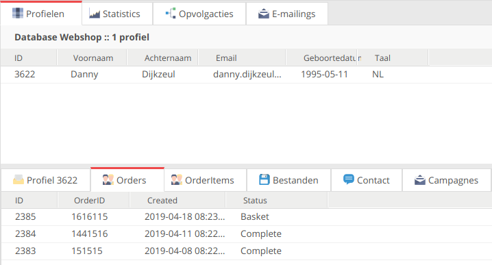
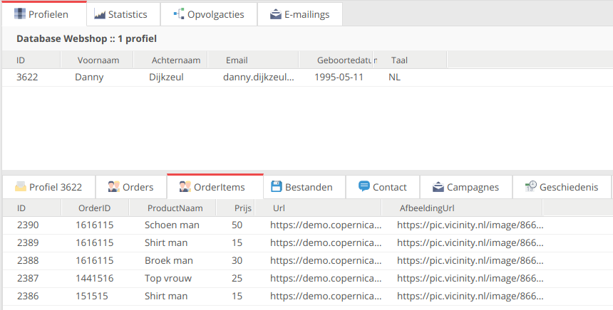

# Herhaalaankoop-campagne
De herhaalaankoop-campagne is een (reeks) e-mail(s) waarmee je klanten eraan herinnert om een product dat bijna op of leeg is opnieuw te kopen. Voor webwinkels die verbruiksgoederen verkopen kan de herhaalaankoop-campagne een effectieve en simpele manier zijn om nieuwe aankopen te stimuleren. Daarnaast biedt deze campagne ook een stukje service naar de klant toe, omdat je laat zien dat je met de klant meedenkt. Over het algemeen is een herhaalaankoope-mail waardevol en relevant voor de klant, daarom behaalt de campagne vaak goede resultaten. Zo heeft de herhaalaankoop-campagne een gemiddeld openratio van tussen de 50-60% en een klikratio van 40-50%!

## Benodigdheden
Om een dergelijke campagne in te richten, moet er een koppeling zijn met je order systeem. Deze hoeft overigens niet *realtime* te zijn, gezien er veelal een periode van meerdere dagen zit tussen het triggeren van de herbestelmail en het daadwerkelijk verzenden van deze mail. In de bestelling dient de volgende data bekend te zijn:

-   **Aanschafdatum.** Deze gebruiken we om nieuwe bestellingen te testen;
-   **Hoeveelheid.** Dit is nodig om de wachttijd te berekenen;
-   **Verbruiktermijn.** Dit wordt gebruikt om de wachttijd te berekenen;
-   **Product informatie.** De productinformatie wordt gebruikt in de herhalingsaankoop mail.

Met deze data kunnen we de herhalingsaankoop gaan instellen. De eerste stap is de opvolgactie klaarzetten. In dit voorbeeld gaan we ervan uit dat er 2 order collecties zijn, een waar waarin alle orders staan en een waarin de producten uit die orders staan. Zoals hieronder weergegeven:



In bovenstaande afbeelding is een profiel met zijn subprofielen in collectie 'Orders' zichtbaar. In deze collectie staan alle orders, de bijbehorende producten staan in collectie 'OrderItems', zoals te zien in onderstaande afbeelding. Deze scheiding wordt gemaakt om de losse producten te kunnen groeperen op basis van het ID van de order.



Dit is collectie 'OrderItems', waarin de losse producten staan. In veld 'OrderID' staat het ID van de order zoals we die in 'Orders' vinden. Verder staan de prijs en een afbeeldingsurl van het product in het subprofiel. Hier staat ook de hoeveelheid, herbesteltermijn en aanschafdatum.


## Opvolgactie
De eerste stap nadat de database goed ingesteld staat, is de opvolgactie aanmaken die de herhaalaankoop mail verstuurt.

-   Maak hiervoor een opvolgactie aan op de 'OrderItems' collectie;
    
-   Geef als aanleiding dat een subprofiel is aangemaakt en geef als extra controle dat de herbesteltermijn groter is dan 0. Als er namelijk geen herhalingstermijn bekend is, willen we geen mail versturen;
    
-   Nu rekenen we de wachttijd van de opvolgactie uit. Dit doen we met behulp van JavaScript middels onderstaande code:
``` javascript
(subprofile.Hoeveelheid*subprofile.Herhaling-1)*86400;
```

-   Hierbij is **subprofile** het subprofiel dat de opvolgactie start en wordt via de velden 'Hoeveelheid' en 'Herhaling' uitgerekend hoeveel dagen er gewacht dient te worden. In dit specifieke voorbeeld trekken we 1 af van het totaal. Dit zorgt ervoor dat de herhalingsmail een dag eerder wordt verstuurd dan dat de de herbesteltermijn verstrijkt. Tot slot wordt het totaal aantal dagen keer 86400 gedaan, omdat in JavaScript met tijd in seconden wordt gerekend;
    
-   Kies vervolgens als actie dat er een mail verstuurd moet worden. Kies in het volgende tabblad de herhalingsaankoop mail. Deze gaan we in een volgende stap personaliseren.


### Opvolgactie extra checks
De opvolgactie staat nu klaar op basis van de levensduur van een product. In de inleiding stelden we echter dat klanten die in de tussentijd hetzelfde product hebben aangeschaft, niet de herbestelmailing moeten ontvangen. Hiervoor moeten we dus nog een extra conditie op de opvolgactie instellen, die bij het uitvoeren van de actie (het sturen van het document) wordt gecontroleerd. Wederom hebben we een stukje JavaScript nodig:


``` javascript
function  shouldSend() {  
	let items = profile.OrderItems;  
	for (var i = 0; i < items.length; i++)  
	{  
		if (items[i].id == subprofile.id) continue;  
  
		if (items[i].Product_ID !=  
		subprofile.Product_ID) continue;  
  
		var d1 = Date.parse(items[i].Aanschafdatum);  
		var d2 = Date.parse(subprofile.Aanschafdatum);  
		if (d1 > d2) return  false;  
	}  
	return  true;  
}  

shouldSend();
```


Bovenstaande code controleert of er een reden is om de verzending te blokkeren: het itereert over alle subprofielen in de collectie 'OrderItems'. Het eerste if-statement controleert of het subprofiel dezelfde aanschaf betreft als degene waardoor de herbestelmailing is getriggerd (in dat geval kunnen we die negeren). De tweede checkt of het een ander soort product betreft (als dat zo is heeft het niets met dit herbesteltraject te maken en gaan we door). Is het wel hetzelfde product, dan kijken we of het recentere aangeschaffing betreft. Is het dat niet, dan laten we de opvolgactie pas doorgaan en wordt de mailing dus verstuurd.

Het zou ook zo kunnen zijn dat je wil dat elke nieuwe aanschaf de lopende herbesteltrajecten blokkeert. Hierboven hebben we geïmplementeerd dat alleen dezelfde producten (zelfde 'Product_ID') het traject blokkeren middels de regel:

``` javascript
if (profile.OrderItems[i].Product_ID != subprofile.Product_ID) continue;
```

Als je die verwijdert, blokkeert elke nieuwe aanschaf de lopende herbesteltrajecten.

### Eigen omgeving
Om te zorgen dat dit ook in je eigen database werkt, dien je de volgende velden aan te passen:
-   'OrderItems' dient de naam krijgen van jouw eigen collectie;
    
-   'Product_ID' dient de naam te hebben van het veld waar het product ID is opgeslagen;
    
-   'Aanschafdatum' moet veranderd worden naar jouw eigen aanschafdatum veld.


## Mailing
Hierna moet het document gebouwd worden dat gestuurd wordt met de opvolgactie. Hier tonen we met behulp van SMARTY de details van het product dat herbesteld kan gaan worden. Een voorbeeld:

```smarty
<table>
	<tr>  
		<td>Naam</td>
		<td>{$mailing.trigger.subprofile.Productnaam}</td>  
		<td>Afbeelding</td>
		<td></td>  
	</tr>  
</table>
```
Bovenstaande SMARTY-code toont de naam van het product dat de opvolgactie heeft getriggerd samen met de afbeelding die wordt ingeladen van de locatie die bij het product hoort. 'Mailing.trigger' bevat het profiel of subprofiel dat de mailing heeft gestart, dit is meestal als gevolg van een opvolgactie. Hierop kunnen we vervolgens het subprofiel opvragen en de juiste data van het product, zoals de afbeelding url of de naam.

De volgende twee punten zijn niet noodzakelijk voor het functioneren van de herhalingsaankoop maar kunnen deze wel verbeteren.

### Feed
Stel dat je alle actuele data van een order wilt gebruiken voor een herhalingsaankoop mail, dan kan je een feed gebruiken. Hiervoor dien je wel te kunnen zoeken op producten in een feed. Stel dat we via de feed een 'productID' kunnen meegeven dan geeft de volgende code het juiste product weer:

  
```smarty
{capture assign='feedlink'}https://example.com/demo.xml?productid={$mailing.trigger.subprofile.productID}{/capture}  
{loadfeed feed=$feedlink xslt='demoXSLT'}
```
 
We gebruiken *capture assign* om een variabele '$feedlink' aan te maken. Deze bevat een gepersonaliseerde link, waarin het id van het product staat dat wij willen ophalen uit de feed. Vervolgens gebruiken we 'loadfeed' om de feed daadwerkelijk op te halen. Vergeet ook niet de XSLT mee te geven zodat het opgehaalde product de juiste styling bevat.

Je kan met bovenstaande manier ook verwante producten ophalen uit de feed. Je vraagt dan het product en zijn verwante producten aan, zodat je een cross sell campagne kan inregelen.


### Limiteer mails
Wanneer een klant 8 producten koopt die allemaal een verbruiktermijn hebben, betekent dit dat er 8 herbestelmailings verstuurd zullen worden. Dit aantal kan aan de hoge kant zijn, wat als ongewenst ervaren kan worden. Om dit te voorkomen kun je een veld 'Herbestelcounter' maken bij het profiel, met als standaardwaarde 0. Indien de database al gevuld is, gebruik dan de functie 'meerdere (sub)profielen wijzigen' om voor elk profiel de waarde op 0 te zetten.

In dit voorbeeld stellen we in dat er nooit meer dan twee herbestelmailings naar een profiel gestuurd mogen worden binnen 7 dagen. Dit realiseren we door bij het verzenden van het document met een opvolgactie het veld 'Herbestelcounter' met 1 te verhogen:

```smarty
{math ​equation​="x+y"​ x=$Herbestelcounter​ y=1}
```

Een tweede opvolgactie op het verzenden van datzelfde document verlaagt de score. Stel hierbij weer een wachttijd in waardoor dit pas na 7 dagen gebeurt.
```smarty
{math equation​="x-y"​ x=$Herbestelcounter​ y=1}
```

De laatste stap is het controleren of het aantal herbestelmailings al is overschreden voordat een nieuwe wordt verzonden. Voeg de volgende regel toe aan de check van de opvolgactie:

```javascript
if (profile.Herbestelcounter >= 3) return false;
```
Dit controleert of een klant meer dan 2 berichten heeft gehad. Als je deze toevoegt aan de opvolgactie conditie dan ziet deze er als volgt uit:

```javascript
function  shouldSend() {    

	if (profile.Herbestelcounter >= 3) return  false;  
	
	let items = profile.OrderItems;  
	for (var i = 0; i < items.length; i++)  
	{  
		if (items[i].id == subprofile.id) continue;  
  
		if (items[i].Product_ID !=  
			subprofile.Product_ID) continue;  
  
		var d1 = Date.parse(items[i].Aanschafdatum);  
		var d2 = Date.parse(subprofile.Aanschafdatum);  
		if (d1 > d2) return  false;  
	}  
	return  true;  
}  

shouldSend();
```

En zo is je herhaalaankoop-campagne klaar.
