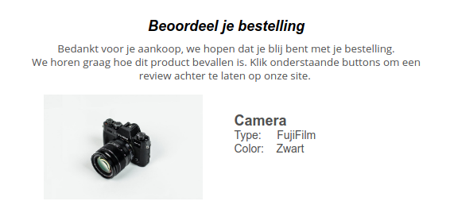
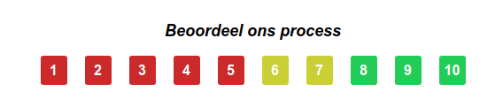

# Review

Bijna negen op de tien consumenten geeft aan dat positieve klantenreviews hun aankoopbeslissing positief beïnvloeden en hoewel consumenten vaak wantrouwig zijn over advertenties en reclames, geeft 70% aan dat ze online reviews van andere klanten wel vertrouwen. Reviews hebben ook nog een andere belangrijke functie: ze bieden een kans om je klanten betrokken te houden en inzicht te krijgen in hoe ze over je producten of diensten denken. Deze informatie kun je vervolgens gebruiken om je service te verbeteren en om te voorkomen dat ontevreden klanten overstappen.
Onderstaande documentatie zal ingaan op hoe je verschillende review campagnes kan maken in Copernica. We gaan er in dit voorbeeld vanuit dat er een collectie is, die alle gekochte orders van een klant bevat. 

## Company review

Een company review houdt in dat je klanten vraagt om jouw bedrijf te beoordelen. Je vraagt hier niet per se naar hun mening over een product maar meer over jouw label. Het is gebruikelijk om dit te doen met twee knoppen in een mailing. Waarbij de positieve knop een klant doorstuurt naar een review platform om een goede review achter te laten. De negatieve knop kan bijvoorbeeld gaan naar een klachtenformulier dat bij de klantenservice uitkomt.  Volg onderstaande stappen om een company review op te zetten in Copernica:
 
De eerste stap is een review mailing maken in de Publisher of Marketing Suite.
Stel links in achter de knoppen. Laat de positieve knop naar je review platform gaan en laat de negatieve knop naar een klachtenformulier gaan. 
Vervolgens gaan we een miniselectie maken die alle orders die kunnen leiden tot een review. Maak een miniselectie en noem deze bijvoorbeeld **Review producten**.
In deze campagne willen we klanten 14 dagen na aankoop vragen om een review te doen. Geef de miniselectie de volgende conditie **check op datum**. Zorg ervoor dat er alleen orders geselecteerd worden die precies 14 dagen geleden gekocht zijn door bijvoorbeeld de ligt na datum en ligt voor datum op 14 dagen geleden te zetten. 
Geef vervolgens de miniselectie een EN conditie die checkt of de orders afgerond zijn. Je wilt niet klanten een review vragen als ze de order terug gestuurd hebben. 
Maak vervolgens een selectie en noem deze **Company Review**. Geef de selectie als conditie **check inhoud miniselectie**. Geef aan dat er minimaal 1 subprofiel in de miniselectie Review producten en zet het maximum op 9999.
Deze selectie bevat nu alle profielen die een review mail moeten ontvangen. Als je mensen niet te vaak een mail wilt sturen dan kan een extra conditie toevoegen die controleert hoe lang geleden iemand de review gehad heeft. 
Stel als laatst in dat de review mailing elke dag naar de Company Review selectie verstuurd. Er zitten namelijk elke dag andere mensen in deze selectie.

## Product review

De volgende review campagne die we opgaan zetten gaat over product reviews. Bij de product review willen we klanten om hun mening over een gekocht product vragen. De insteek is vergelijkbaar met company review, alleen wil de gekochte producten ook in de mailing tonen. Om die reden gaan we gebruik maken van een opvolgactie in plaats van een selectie. 


Net als bij de company review maak je een mail in Publisher of Marketing Suite. Besluit of je nu ook weer de positieve en negatieve reacties wilt scheiden of dat je klanten liever altijd een review laat achter laten. 
Om de informatie van de gekochte order te tonen maken we gebruik van **mailing.trigger**. Bij vorige campagnes is deze ook al eens gebruikt maar hieronder een korte samenvatting:
	mailing.trigger bevat het profiel of subprofiel dat de mailing activeert. Je gebruikt dit eigenlijk alleen als je subprofiel data wilt gebruiken van het subprofiel dat de mailing activeert. Je gebruikt mailing.trigger als volgt:
 ```
{$mailing.trigger.subprofile.veldnaam}

```
In ons voorbeeld willen we bijvoorbeeld standaard product info tonen. Dit zou er als volgt uit kunnen zien:

```
Naam: {$mailing.trigger.subprofile.Naam}
Type: {$mailing.trigger.subprofile.Type}
Kleur: {$mailing.trigger.subprofile.Kleur}

```


Nu onze mail staat kunnen we tot slot de opvolgactie instellen die de mail verstuurd. 

Stel opvolgactie in op de collectie Orders. 
De opvolgactie wordt gestart door een subprofiel dat aangemaakt of gewijzigd wordt. Selecteer het vinkje en geef dat het veld Status aangepast is naar Complete. Dit zorgt ervoor dat alleen complete orders gebruikt worden.
Geef bij de actie aan de er een mail verstuurd dient te worden en geef de wachttijd aan. De wachttijd houdt in na hoeveel dagen de mailing verstuurd wordt.
Selecteer in de volgende stap de Product review mailing en geef aan dat deze naar het profiel gestuurd wordt. 

## NPS score

Als laatst review campagne maken we een NPS mailing. NPS staat voor net promoter score en deze wordt vaak gebruikt om klanttevredenheid te meten. In ons voorbeeld gaan we de klanten een score laten toekennen aan het bezorgprocess. 

Stap 1 is net als de bij de vorige campagnes om een mailing te maken. Zorg er in de mailing voor dat er meerdere knoppen zijn waar klanten op kunnen klikken om de NPS score aan te kunnen geven. Bijvoorbeeld zoals onderstaande:




Voeg een opvolgactie toe per button groep
Gebruik verzend text email als lager dan 6
Laat 6-7 een form invullen
8-10 laat een review achterlaten
