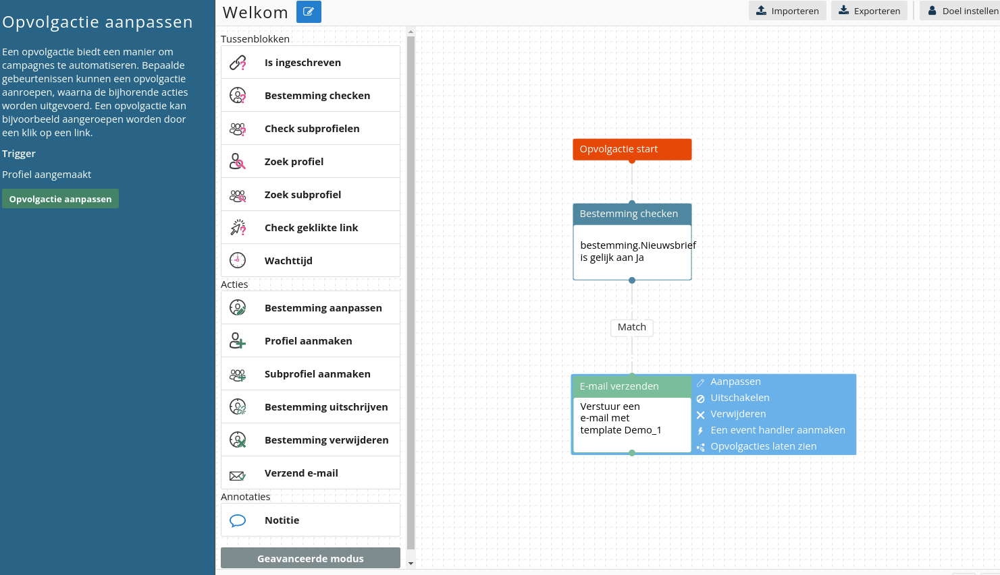

# Welkomstcampagne
Om te zorgen dat jij je nieuwe klanten goed verwelkomt, is een
welkomstcampagne essentieel. In deze tutorial wordt uitgelegd hoe een simpele
welkomstcampagne kan worden opgezet. Bij deze campagne wordt er een
single optin gebruikt. Wil je een dubbele optin campagne? Klik dan
[hier](./campaign-tutorial-double-opt-in.md).

## Aanmaken in Marketing Suite
Ga naar **Profielen**, selecteer de juiste database en klik vervolgens op **Opvolgacties**. Kies voor een nieuwe opvolgactie door te klikken op **Opvolgactie aanmaken**. Vervolgens klik je nogmaals op **Opvolgactie aanmaken**.

De reden (trigger) waarom deze opvolgactie start is **profiel aangemaakt**. Selecteer deze optie en geef de opvolgactie een naam. In de volgende stap gaan we de daadwerkelijke actie opstellen. Bepaal of er gekeken moet worden of het profiel is ingeschreven voor de nieuwsbrief. Als dit het geval is kies je voor het tussenblok **Bestemming checken** en selecteer je het Opt-in veld. Als het profiel niet ingeschreven hoeft te zijn, kun je het blok 'Bestemming checken' overslaan. Maak een match-link aan en klik op de actie **Verzend e-mail** en verbind dit blok aan de match-link. Klik op **Aanpassen** in het e-mail verzenden-blok om de welkomstmail te selecteren. Als dit gedaan is sla je de opvolgactie op door links in het scherm te klikken op **Opvolgactie aanpassen**.

**Let op**: Het is niet nodig om deze opvolgactie ook aan te maken in Publisher. Als je dit wel doet ontvangen nieuwe profielen dubbele e-mails. 

De opvolgactie ziet er als volgt uit:  



## Aanmaken in Publisher
Ga naar **Profielen** en klik op **Databasebeheer > Database opvolgacties**
en ga naar **Nieuwe opvolgactie aanmaken**. De aanleiding is
**er is een profiel aangemaakt**, de actie is
**Verstuur een opgemaakt document per e-mail** en er is geen wachttijd. Klik
op volgende en selecteer de welkomstmail.

**Let op**: zet deze actie _alleen_ in de Publisher. Zet hem niet ook nog
in Marketing Suite, dan krijgen klanten 2 welkomstmail.

## Kortingscode genereren
Het is mogelijk om een kortings code te maken met Copernica, dit doen we doormiddel van het e-mail adres en een stuk tekst te versleutelen tot een code. We doen dit met de [SHA1](./personalization-modifiers#sha1) encryptie methode, deze is standaard beschikbaar in smarty en gebruik je als volgt.

```

{"Dit bericht wordt versleuteld"|sha1}

```

Om het email adres en een sleutelwoord te versleutelen gebruiken we [capture assign](./publisher-personalization-functions#capture). Het sleutel wordt is in dit geval **Welkom**.

``` 

{capture assign="welkomkorting"}{$profile.Email}Welkom{/capture}{$welkomkorting|sha1}

```

Omdat de volledig versleutelde code erg lang is, willen we in dit geval alleen de eerste 8 karakters. Deze eerste 8 selecteren we door de [truncate](./personalization-modifiers#truncate) functie te gebruiken. 

``` 

{capture assign="welkomkorting"}{$profile.Email}Welkom{/capture}{$welkomkorting|sha1|truncate:8:"":true}


```

Stel vervolgens een opvolgactie in die het bovenstaande stukje code in een kortingscode veld stop als een profiel wordt aangemaakt. Kortom

- Maak een opvolgactie aan op de database met als aanleiding er is een profiel aangemaakt
- Kies de actie wijzig het profiel
- Kies het veld waar de kortingscode ingevuld moet worden
- Kies als waarde de bovengenoemde code om de kortingscode te genereren. 

Deze code kan op dezelfde manier versleuteld worden aan de webshop kant, zodat gecontroleerd kan worden of een code wel of niet gebruikt is. 

## Bepaal opens welkomstraject
Zoals uitgelegd in [campagne uitgelicht 5](https://www.copernica.com/nl/blog/post/campagne-uitgelicht-editie-5-welkomstcampagnes) kunnen de opens van de welkomsmails een goede indicatie geven over de betrokkenheid van een klant. We gaan hiervoor een [intressegroep](./database-fields#interesses) aanmaken die per welkomsmail kan aangeven of deze is geopend, zodat we de klanten hierna in segementen kunnen indelen. In dit voorbeeld gebruiken we 3 welkomsmails. 

- Maak een nieuwe interesse aan via **database velden wijzigen**
- Geef als naam bijvoorbeeld welkom1 of de naam van de eerste welkomstcampagne
- Geef de groep de naam **WelkomstReeks**, dit is de groep waarin we alle andere interesse ook opslaan
- Herhaal de vorige twee stappen ook voor welkom2 en welkom3
- Ga naar Emailings en maak een opvolgactie aan op de eerste welkomstmail
- Geef als aanleiding dat er een impressie is geregisteerd 
- Geef als actie dat er een profiel gewijzigd moeten worden
- Kies vervolgens de welkom1 interesse uit de database en zet deze op yes
- Herhaal de vorige 4 stappen ook voor de andere welkomstcampagnes

Nu wordt in de interesse groep **WelkomstReeks** bijgehouden welke welkomstmails een klant geopend heeft. Hierop kan je vervolgens een selectie maken om onderscheid tussen actieve en niet actieve te zien. 
