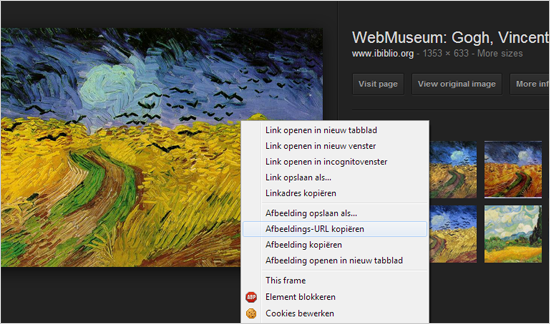

# Afbeeldingen hosten op een andere server

Afbeeldingen die je gebuikt in een mailing kan je uploaden naar
Copernica, maar je kan deze ook direct van een andere locatie laden.
Bijvoorbeeld direct linken naar een afbeelding die je hebt gevonden met
Google Images.

Wanneer je afbeeldingen van een andere site haalt, kunnen deze later
natuurlijk door de beheerder van die site worden verwijderd. De
afbeelding zal dan niet meer getoond kunnen worden zijn in jouw mailing.
Om er zeker van te zijn dat een afbeelding altijd beschikbaar blijft in
je mailing, kan je er voor kiezen om de externe afbeeldingen op te slaan
op onze server zonder dat je deze zelf hoeft te uploaden naar Copernica.

 *Afbeelding: de bestands-URL van een
afbeelding gevonden met Google images is zo gekopieerd. Maar bestaat
deze afbeelding nog over 2 weken?*

#### Afbeeldingen uit e-mailing automatisch opslaan op onze server

Kies bij het instellen van een bulkmailing in het tabblad **Opties**voor
de optie om externe afbeeldingen op onze servers te bewaren. De
afbeeldingen worden nu op onze picservers opgeslagen en zullen tot in de
eeuwigheid beschikbaar blijven.
