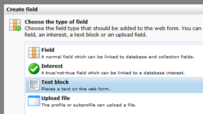

# Afbeeldingen in webformulieren

Het is diverse manieren mogelijk om afbeeldingen te gebruiken in je
webformulier. Je kan afbeeldingen plaatsen in een formulier tekstblok,
of afbeeldingen gebruiken in gekoppelde XSLT en CSS bestanden.

**In een tekstblok.**Voeg een tekstblok to aan een webformulier. Gebruik
vervolgens de uitgebreide editor om een afbeelding in te voegen.

**Met behulp van XSLT.** De weergave van je webformulier wordt mede
bepaald door de standaard gekoppelde XSLT, die de rauwe XML webformulier
data omzet naar (voor de browser leesbare) HTML. Je kan deze XSLT
aanpassen, en op deze wijze ook afbeeldingen toevoegen. Een XSLT bestand
beschikt over een eigen afbeeldingen map, waar je bestanden en
afbeeldingen naartoe kunt uploaden.

Ook gekoppelde CSS bestanden hebben een eigen bestandenmap.

Afbeelding - *Het webformulierveld 'Teksblok' maakt het mogelijk
afbeeldingen en andere content te tonen onder of boven andere
webformulier velden.*
