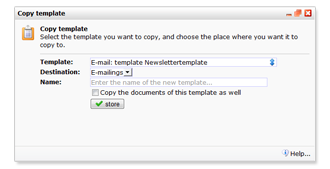

# E-mailtemplate als webtemplate

Je kan een e-mailtemplate ook gebruiken als webtemplate, door de
e-mailtemplate te kopiëren naar het onderdeel Websites. Andersom is
vanzelfsprekend ook mogelijk.

Ga hiervoor naar het **Kopieer...** dialoogvenster in het menu van de
e-mailtemplate.

Kies vervolgens **Websites**als bestemming

De andere kant op
-----------------

Op dezelfde wijze kan je vanuit **Websites** een webtemplate naar het
onderdeel **E-mailings**kopiëren. Let hierbij wel op dat de HTML
richtlijnen voor e-mailtemplates afwijken van die voor normale
webpagina's. Webformulieren en enquetes kunnen niet meeworden gekopieerd
naar E-mailings, omdat deze technieken niet worden ondersteund door
e-mailprogramma's.

Wanneer je een document kopieert naar een template met een afwijkende
blokstructuur, dan is het mogelijk dat bepaalde delen uit het origineel
niet mee worden gekopieerd.
