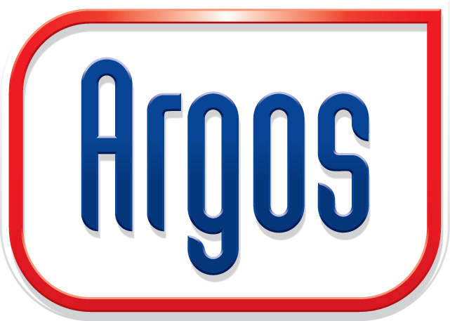

[Argos](http://argosenergies.com/nl/ "Argos")
is sinds maart 2012 hoofdsponsor van de wielerploeg Team Argos-Shimano.
Hiermee wil het bedrijf zijn Europese groei-ambities versterken en de
merknaam steviger op de Europese kaart zetten.\
\
Naar aanleiding van de Tour de France werd daarom de actie ‘Argos Tour
Weken’ opgezet. Deze actie had als voornaamste doel meer klantprofielen
te verzamelen in de database van Argos en natuurlijk bekendheid te geven
aan de deelname van het Team Argos-Shimano aan de Tour de France.\
\
**De Argos Tour Weken\
\
**De campagne werd opgezet in samenwerking met Copernica Registered
Partner
[Digitalbits](http://www.copernica.com/nl/ondersteuning/partner/4543021 "Digitalbits")
en een extern reclamebureau. Digitalbits ontwikkelde de actiesite en
verzorgde de koppeling met Copernica.\
\
**Toepassingen gebruikt binnen Copernica**\
\

-   Gesegmenteerde
    [database](./creating-your-own-databases.md)
    binnen Copernica
-   [Gepersonaliseerde
    actiemail](./create-clever-emailings.md)
    om uit te nodigen voor inschrijving nieuwsbrief
-   [Geautomatiseerde
    mail](./automate-your-campaigns.md)
    om winnaars en verliezers op de hoogte te stellen
-   Op maat gemaakte
    [actiesite](http://www.copernica.com/nl/functies/webpaginas/maak-en-publiceer-je-eigen-webpaginas)
-   Op maat gemaakt
    [actieformulier](./various-types-of-web-forms.md)
    gekoppeld aan database Copernica
-   Koppeling tussen Copernica en externe MySQL database via [SOAP
    API](./soap-api-documentation.md)

\
**Hoe werd de actie opgezet?\
\
**Bezoekers
van deelnemende Argos tankstations ontvingen tijdens de vier Tourweken
een actiecode voor iedere tankbeurt van Euro 25,-. Met deze actiecode
maakte men kans op diverse prijzen zoals onder meer een tankpas met een
tegoed van Euro 1.500,- , een tankpas met een tegoed van Euro 500,- of
een wielershirt van Team Argos-Shimano.\
\
Op de actiesite kon de bezoeker een of meerdere actiecodes invullen en
in combinatie met de benodigde NAW-gegevens en e-mailadres werden deze
verwerkt in Copernica.\
\
Met behulp van de koppeling tussen Copernica en een externe database van
Argos werden de actiecodes gecontroleerd op juistheid. Nadat de
actiecode geverifieerd was, werd het nieuwe profiel toegevoegd aan de
database in Copernica. De actiecodes waren verdeeld per station zodat
per profiel terug te leiden was bij welk station men getankt heeft. Na
afloop van de actie kregen de winnaars en verliezers nog een
geautomatiseerde mail met daarin een uitnodiging zich aan te melden voor
de nieuwsbrief van Argos.\
\
**Het resultaat\
**\
In slechts vier weken tijd werden ruim 14.000 actiecodes ingevuld.
Daarbij schreven 26% van de deelnemers aan de Tourweken zich ook in voor
de nieuwsbrief.\
\
**\
**
