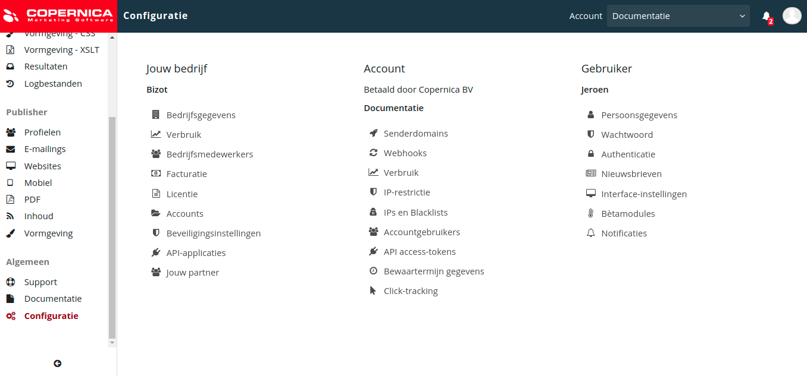

# Configuratie
Op de configuratiepagina kun je allerlei zaken instellen en inzien. Instellingen zijn onderverdeeld in drie kolommen. Deze komen overeen met het toegangssysteem en de licentiestructuur van Copernica. 

* Onder het kopje __Jouw bedrijf__ staan alle bedrijfsinstellingen.
* Onder het kopje __Account__ staan de instellingen van je huidige account.  
* Onder het kopje __Gebruiker__ staan jouw persoonlijke gebruikersinstellingen.

## Bedrijfsinstellingen  
* __Bedrijfsgegevens:__ de basisgegevens van jouw bedrijf (bedrijfsnaam, adres enzovoort). 
* __Verbruik:__ inzage in het totale verbruik (zoals het aantal verzonden berichten) van alle accounts samen. 
* __Bedrijfsmedewerkers:__ inzage in de gebruikers (collega's) die gekoppeld zijn aan het bedrijfsprofiel. 
* __Facturatie:__ inzage in de facturen. 
* __Licentie:__ inzage in de licentievoorwaarden. 
* __Accounts:__ de accounts die door jouw bedrijf worden afgenomen. 
* __Beveiligingsinstellingen:__ de beveiligingsinstellingen die van toepassing zijn op alle collega's.
* __API-applicaties:__ de gekoppelde API-applicaties (lees [hier](./apis) meer over de API). 
* __Jouw partner:__ inzage in wie jouw partner is (lees [hier](https://www.copernica.com/nl/support/partners) meer over onze partners).

## Accountinstellingen
* __Senderdomains:__ inzage in de senderdomains binnen jouw account (lees [hier](./sender-domains) meer over senderdomains).
* __Webhooks:__ inzage in de webhooks binnen jouw account (lees [hier](./webhooks) meer over webhooks).
* __Verbruik:__ inzage in het verbruik (zoals het aantal verzonden berichten) van jouw account.  
* __IP-restrictie:__ de ingestelde IP-restricties voor jouw account.
* __IPs en Blacklists:__ inzage in IP-adressen en blacklists.
* __Accountgebruikers:__ de accountgebruikers die toegang hebben tot jouw account.
* __API access-tokens:__ de gekoppelde API access-tokens (lees [hier](./apis) meer over de API).
* __Bewaartermijn gegevens:__ de ingestelde bewaartermijn van jouw accountgeschiedenis.

## Gebruikersinstellingen  
* __Persoonsgegevens:__ de basisgegevens van jouw gebruiker (voor- en achternaam, e-mailadres enzovoort). 
* __Wachtwoord:__ wachtwoordinstellingen voor jouw gebruiker.
* __Authenticatie:__ twee-factor-authenticatie instellen voor jouw gebruiker.
* __Nieuwsbrieven:__ in- of uitschrijven voor Copernica-gerelateerde updates. 
* __Interface-instellingen:__ het uiterlijk van de software aanpassen.  
* __Bètamodules:__ inzage in modules die nog in ontwikkeling zijn. 
* __Notificaties:__ inzage in notificaties voor jouw gebruiker.
