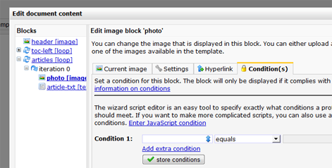

Het is mogelijk om content blokken conditioneel in je document te laden.
Zodat persoon A andere inhoud ziet dan persoon B.

Je kan de weergave van tekst-, afbeelding- en loopblokken op twee
verschillende manieren conditioneel maken:

-   Met gebruik van smarty *if* en *else*statements in de template
    broncode.
-   Met behulp van content blok condities van het content blok zelf
    (alleen afbeelding- en tekstblokken).

Beide methodes werken prima. Met Smarty vanuit je template broncode is
iets flexibeler, maar geeft een wat drukker beeld als je de template in
Bewerkmodus bekijkt (met name wanneer je uitgebreide smarty code gaat
schrijven).

### Smarty personalisatie gebruiken in de template broncode

Met behulp van condities die je schrijft met Smarty code kan je meer
flexibiliteit aanbrengen in de template. Het maakt het mogelijk om
bijvoorbeeld een andere lay-out te tonen op basis van het geslacht van
de ontvanger.

Onderstaand voorbeeld toont een tekstblok aan iedereen, behalve aan
ontvangers uit Amsterdam. Handig als je iets naars over Ajax te melden
hebt, en je wilt Amsterdammers niet tegen het zere been schoppen.

> `{if $profile.plaats != "Amsterdam"} [text name="artikel"] {/if} `

-   [Meer lezen over smarty if en else constructies](#)

### Met behulp van de content block conditie editor

Met de content block conditie editor kan je blokken tonen of juist
verbergen op basis van gegevens uit het profiel of subprofiel.

Je stelt deze voorwaarden op in het tabblad **Condities** van het
**afbeelding**, **loop** of **tekst blok**.

Het blok wordt getoond op het moment dat het profiel of subprofiel
voldoet aan de conditie.

Dus met een conditie *geslacht*[ is gelijk aan ] *man* wordt het blok
alleen getoond aan mannen en niet aan vrouwen.

Als er meerdere condities zijn ingesteld, wordt het blok pas getoond
wanneer alle condities naar **true** valideren.

Als je wilt dat het blok wordt getoond wanneer het profiel voldoet aan 1
van de condities (een OF conditie), dan kan je dit instellen met de
geavanceerde editor (waarin je je condities zelf schrijft met
Javascript).

Met onderstaande code toon je een blok alleen aan profielen uit Haarlem
OF Amsterdam. Aan iemand uit bijvoorbeeld Emmer-Erfafscheidenveen,
Zwammerdam of Gasselterboerveenschemond zal het blok niet getoond
worden.

`profile.stad == 'Amsterdam' || profile.stad == 'Haarlem';`

*Afbeelding - condities instellen bij een content blok, met behulp van
de eenvoudige script editor*

Voor het maken van de condities kan je zowel de [Eenvoudige script
editor](./de-eenvoudige-script-editor.md)
en de [JavaScript
editor](./geavanceerde-javascript-condities.md)
gebruik maken.

### Extra (geavanceerde) opties voor loop blokken

Net als bij een smarty *foreach* loop, zijn extra functies beschikbaar,
zoals iteratie, index, first en last welke kunnen worden gebruikt om
informatie op te vragen over de items die worden herhaald.

-   .**index** geeft het totaal aantal iteraties, beginnend met nul
-   .**iteration** bevat de huidige loop iteratie, beginnend met nul
-   .**first** geeft de waarde true terug wanneer de huidige loop
    iteratie de eerste is
-   .**last** geeft de waarde true terug wanneer de huidige loop
    iteratie de laatste is.

Deze extra paramaters kan je bijvoorbeeld gebruiken om de inhoud en
opmaak van een loop iteratie te manipuleren.

### Enkele voorbeelden

Veronderstel, je hebt een loop blok [loop name="row"] die in het
document 3 keer wordt geitereerd. Je kan dan de huidige iteratie
opvragen als volgt:

`[$loop.row.iteration]`

En bijvoorbeelde de eerste iteratie in een variabel zetten:

> `[loop name="row"] {capture assign="thisrow"} [if $loop.row.first]first, [else]other, [/if] {/capture} {$thisrow} [/loop]`

Wanneer je het document gepersonaliseerd weergeeft, zal dit het
resultaat zijn:

First, other, other,

### Geneste loops

Wanneer je gebruik maakt van geneste loops in de template (bijvoorbeeld
loop A en loop B), dan kan je de child loop alsvolgt benaderen:

`[$loop.loopA.loopB.index]`

waarbij je *index* ook kan vervangen door *iteration, first*of *last*.
