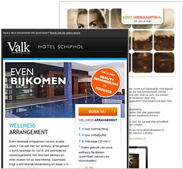

# Copernica en marketingbureaus

Ontwerp zelf marketingcampagnes in je eigen huisstijl of die van je
klant. Maak daarnaast gebruik van Copernica’s follow-up manager om
communicatieprocessen te automatiseren.

Krachtige functionaliteiten voor Bureaus
----------------------------------------

-   Ontwerp uitgebreide
    [templates](http://www.copernica.com/nl/functies/e-mailings/ontwerp-je-eigen-templates "Ontwerp je eigen templates")
    voor eigen gebruik of voor je klanten
-   Zet Copernica in als marketingoplossing voor eigen klanten
-   Neem deel aan het
    [partnernetwerk](./register-as-copernica-partner.md "Ontdek ons partnerprogramma")
    en kom in contact met de eindgebruikers van Copernica
-   Beheer meerdere accounts vanuit één omgeving, maak net zoveel aan
    als je klanten hebt
-   Breid je productportfolio uit met Copernica en genereer extra omzet
    dankzij het [Copernica\

    partnermodel](./register-as-copernica-partner.md)

Copernica is krachtige marketingsoftware voor\

[e-mailmarketing](http://www.copernica.com/nl/functies/e-mailings "e-mailmarketing"),
[webpagina's](http://www.copernica.com/nl/functies/webpaginas "webpagina's"),
[mobile](http://www.copernica.com/nl/functies/mobile "mobile") &
[automatische
campagnes](http://www.copernica.com/nl/functies/e-mailings/automatiseer-je-campagnes "automatische campagnes").\
\
[Test Copernica nu
gratis!](http://www.copernica.com/nl/copernica-30-dagen-proberen "Test Copernica nu gratis!")

-   Creëer & verzend e-mailmarketingcampagnes
-   Automatiseer al je contactmomenten
-   Verrijk gegevens in een centrale database
-   Genereer dynamische & relevante content
-   Integreer naadloos met elk systeem

Wat onze gebruikers zeggen
--------------------------

> "Copernica is toegevoegd aan ons leveringsgamma vanwege de uitstekende
> integratiemogelijkheden, gebruiksvriendelijkheid en betrouwbaarheid."
> 
>
> \
> **Bookerz**\
> [www.bookerz.nl](http://www.bookerz.nl)

> "Met Copernica hebben wij krachtige software in handen om opdrachten
> voor klanten uit te voeren. Combinaties met e-mail, mobile en PDF zijn
> te eenvoudig bedienen vanuit één omgeving."
> 
>
> \
> **Redhotminute**\
> [www.redhotminute.com](http://www.redhotminute.com)
