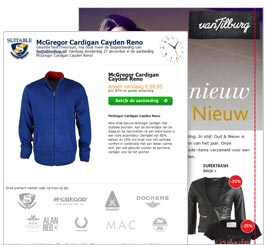

Met de
e-mailmarketingsoftware van Copernica hou je jouw klanten nog beter op
de hoogte van de laatste fashiontrends en aanbiedingen die bij hen
passen. Stel uitgebreide klantprofielen op en verzend professionele
e-mailcampagnes op basis van interesses en gedrag. Verstevig de
loyaliteit van je klanten door ze up-to-date te houden van de nieuwste
mode en winkelevents. Ontdek zelf alle mogelijkheden van Copernica
Marketing Software met een [gratis
proeflicentie](https://www.copernica.com/nl/copernica-proberen "Probeer Copernica gratis").

> "Momenteel behalen we ontzettend mooie resultaten met de software te
> denken aan een click through rate van meer dan 20% uit onze
> e-mailings!" 
>
> \
> **Suitable**\
> [www.suitableshop.nl](http://www.suitableshop.nl)

Krachtige functionaliteiten voor Fashion
----------------------------------------

-   Stel eenvoudig up- en cross-sell campagnes op
-   Stem je productaanbod af op [historische
    aankoopdata](./define-target-groups-with-selections.md)
-   Volg
    [automatisch](./automate-your-campaigns.md)
    online achtergelaten winkelwagentjes op met één of meerdere e-mails
-   [Personaliseer je
    landingspagina's](http://www.copernica.com/nl/functies/webpaginas/maak-en-publiceer-je-eigen-webpaginas)
    aan de hand van interesses, merkvoorkeuren, meest bekeken of laatst
    bekeken producten
-   Zet een eigen loyaliteitsprogramma op en stuur klanten persoonlijk
    relevante aanbiedingen op basis van het aantal spaarpunten
-   Pas campagnes aan op basis van de locatie van je klant

Interessante artikelen
----------------------

Copernica schrijft op regelmatige basis interessante artikelen en cases.
Hieronder vind je een greep uit deze artikelen.

-   [Vier tips om de click-through rates van je e-mails te
    verhogen](http://www.copernica.com/nl/over-ons/nieuws/vier-tips-om-de-click-through-rates-van-je-e-mails-te-verhogen)
-   [Haal meer omzet uit je bezoekers: 3 valkuilen om op te
    letten](https://www.copernica.com/nl/blog/haal-meer-omzet-uit-je-bezoekers-3-valkuilen-om-op-te-letten)
-   [Four fundamentals of fashion marketing
    (Engels)](https://www.copernica.com/en/blog/four-fundamentals-of-fashion-marketing)

Of lees een van onze inspirerende cases:

-   [Suitable legt focus op frequenter en gesegmenteerd
    mailen](https://www.copernica.com/nl/blog/suitable-legt-focus-op-frequenter-en-gesegmenteerd-mailen)
-   [SAPPH schakelt Copernica Marketing Software in voor
    webshop](https://www.copernica.com/nl/blog/sapph-schakelt-copernica-marketing-software-in-voor-webshop)
-   [Kleertjes.com over het effect van cross-selling en
    up-selling.](https://www.copernica.com/nl/blog/kleertjes-com-over-het-effect-van-cross-selling-en-up-selling)
-   [Seizoensgebonden en event-based communicatie met
    Vimodos.nl](https://www.copernica.com/nl/blog/seizoensgebonden-en-event-based-communicatie)

De volgende fashion brands gingen je voor
-----------------------------------------

Copernica Marketing Software wordt door vele modeketens en organisaties
ingezet. Hieronder een greep uit enkele bekende klanten uit de
mode-industrie die gebruikmaken van Copernica Marketing Software.

