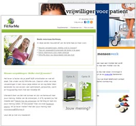

Met Copernica deel je je totale klantenbestand eenvoudig op in relevante
doelgroepen op basis van leeftijd, geslacht of levensstijl (bv. zwangere
vrouwen). Stuur vervolgens gerichte en persoonlijke e-mailings op basis
van de opgeslagen klantgegevens.

Wat kan je zoal met Copernica?
------------------------------

-   Stuur klanten [geautomatiseerde
    e-mailings](http://www.copernica.com/nl/functies/e-mailings/automatiseer-je-campagnes "Automatiseer je campagnes")
    om hun te informeren over een workshop
-   Automatically send your clients emails or SMS to remind them of
    their appointment
-   Gebruik data zoals leeftijd en geslacht voor gerichte en relevante
    e-mailcampagnes
-   Verzend je klanten [persoonlijke
    e-mailings](http://www.copernica.com/nl/functies/e-mailings/maak-zelf-slimme-e-mailings "Maak en personaliseer zelf e-mailings")
    op basis van hun aankoopgedrag of interesses
-   Deel je volledige
    [klantendatabase](http://www.copernica.com/nl/functies/profielen/maak-je-eigen-database "Maak je eigen database")
    op in segmenten op basis van o.a. interesses & leefstijl

\
\

Wat onze gebruikers zeggen
--------------------------

> "Dankzij de koppeling van Copernica met onze webwinkel zijn wij in
> staat automatisch relevante en gerichte e-mailcampagnes te verzenden."
> 
>
> \
> **FitForMe**\
> [www.fitforme.nl](http://www.fitforme.nl)

> "Met behulp van de software kan PRA gepersonaliseerde e-mailings
> verzenden naar onze vrijwilligers die willen deelnemen aan een
> geneesmiddelenonderzoek." 
>
> \
> **PRA International**\
> [www.praintl.com](http://www.praintl.com)
