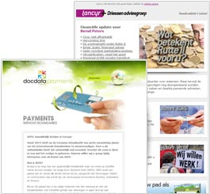

Sla alle gegevens van je klant op binnen Copernica en stuur gerichte
e-mails wanneer voor specifieke klanten financiële voordelen ontstaan.
Nieuwe leads binnenhalen? Met Copernica zet je makkelijk eigen
formulieren en actiepagina’s op.

Krachtige functionaliteiten voor Verzekeringen
----------------------------------------------

-   Informeer klanten via [automatische
    e-mails](http://www.copernica.com/nl/functies/e-mailings/automatiseer-je-campagnes)
    bij een wijziging van hun polis
-   Stel klanten in staat schade te melden via zelf gemaakte
    [webformulieren](http://www.copernica.com/nl/functies/webpaginas/verschillende-soorten-webformulieren)
-   Herinner klanten via
    [SMS](http://www.copernica.com/nl/functies/mobile/sms-bericht-verzenden)
    hoe lang ze nog hebben om hun verzekering aan te passen
-   Zet krachtige
    [winbackcampagnes](http://www.copernica.com/nl/over-ons/nieuws/event-driven-e-mailcampagnes-gebruik-jij-ze-al)
    op om overgestapte klanten terug te winnen
-   Wilt een klant zijn polis opzeggen? Zet een automatisch mailtraject
    op om de voordelen van jouw polis te verduidelijken en overtuig hem
    bij jouw verzekering te blijven

Copernica is krachtige marketingsoftware voor\

[e-mailmarketing](http://www.copernica.com/nl/functies/e-mailings "e-mailmarketing"),
[webpagina's](http://www.copernica.com/nl/functies/webpaginas "webpagina's"),
[mobile](http://www.copernica.com/nl/functies/mobile "mobile") &
[automatische
campagnes](http://www.copernica.com/nl/functies/e-mailings/automatiseer-je-campagnes "automatische campagnes").\
\
[Test Copernica nu
gratis!](http://www.copernica.com/nl/copernica-30-dagen-proberen "Test Copernica nu gratis!")

-   Creëer & verzend e-mailmarketingcampagnes
-   Automatiseer al je contactmomenten
-   Verrijk gegevens in een centrale database
-   Genereer dynamische & relevante content
-   Integreer naadloos met elk systeem

Wat onze gebruikers zeggen
--------------------------

> "Via Copernica kunnen wij onze klanten en partners op de hoogte houden
> over ontwikkelingen op ons betaalplatform en over algemene trends
> binnen het betaallandschap." 
>
> \
> **Docdata Payments**\
> [www.docdata.com](http://www.docdata.nl/)

> Via Copernica segmenteren wij onze klanten bijvoorbeeld op basis van
> polis- en/of klantgegevens. En aan de hand van de selecties verzenden
> wij gericht e-mails en digitale nieuwsbrieven.
> 
>
> \
> **Univé Regio+**\
> [www.univeregioplus.nl](http://www.univeregioplus.nl/)
