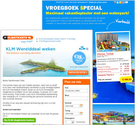

Zet Copernica in
om je klant te voorzien van alle relevante informatie omtrent zijn reis.
Stuur uitgebreide bevestigingsmails van reservatie met dynamische
content op basis van de bestemming of breng hem op de hoogte van
gewijzigde gates of vluchttijden via geautomatiseerde sms-berichten of
e-mails.

Krachtige functionaliteiten voor Travel
---------------------------------------

-   Stem de inhoud van de
    [e-mailing](http://www.copernica.com/nl/functies/e-mailings/maak-zelf-slimme-e-mailings)
    af op basis van interesses of eerdere vakanties
-   Volg brochure-aanvragen
    [automatisch](http://www.copernica.com/nl/functies/e-mailings/automatiseer-je-campagnes)
    op en verwijs naar de dichtstbijzijnde reisagent
-   Stuur een week na terugkomst reizigers automatisch een e-mail waarin
    je vraagt hun vakantie te
    [beoordelen](http://www.copernica.com/nl/functies/webpaginas/enquetes)
-   Hou reizigers op de hoogte van het weer, uitgaanstips of nuttige
    informatie op de plek van bestemming via e-mail of
    [SMS](http://www.copernica.com/nl/functies/mobile/maak-je-eigen-sms-bericht)
-   Gebruik eerdere vakanties, vakantievoorkeuren (zomer, winter,
    strand, actief, etc.) om je klanten een nieuw relevant aanbod te
    bieden

\

### Interessante artikelen voor Travel

Copernica schrijft op regelmatige basis interessante artikelen en cases
relevant voor travel. Hieronder vind je een greep uit deze artikelen en
cases.

-   [Het succesverhaal van Vliegtickets.nl: Haal meer uit je beschikbare
    data](http://www.copernica.com/nl/over-ons/presentaties/vliegtickets-en-copernica)
-   [Vier tips om de click-through-rates van je e-mails te
    verhogen](http://www.copernica.com/nl/over-ons/nieuws/vier-tips-om-de-click-through-rates-van-je-e-mails-te-verhogen)

Copernica is krachtige marketingsoftware voor
[e-mailmarketing](http://www.copernica.com/nl/functies/e-mailings "e-mailmarketing"),
[webpagina's](http://www.copernica.com/nl/functies/webpaginas "webpagina's"),
[mobile](http://www.copernica.com/nl/functies/mobile "mobile") &
[automatische
campagnes](http://www.copernica.com/nl/functies/e-mailings/automatiseer-je-campagnes "automatische campagnes").\
\
[Test Copernica nu
gratis!](http://www.copernica.com/nl/copernica-30-dagen-proberen "Test Copernica nu gratis!")

Wat onze gebruikers zeggen
--------------------------

> "Met de marketingsoftware van Copernica tillen wij onze
> e-mailmarketing naar\
>  een hoger niveau!" 
>
> \
> **Vliegtickets.nl**\
> [www.vliegtickets.nl/](http://www.vliegtickets.nl)
