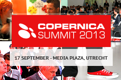

Een hele
dag gevuld met inspiratie, tips, tricks, trends en topsprekers uit de
online marketingwereld!

Het Copernica Summit is een leuke, interactieve middag geweid aan de
laatste trends, tips en cases op het gebied van online marketing. Het
event wordt ondersteund door vele mediapartners als
[Twinkle](http://twinklemagazine.nl/),
[Thuiswinkel.org](http://www.thuiswinkel.org/home),
[Marketingfacts](http://marketingfacts.nl/),
[Sprout](http://www.sprout.nl/) en nog vele anderen.

Speciaal ochtendprogramma voor gebruikers & bureaudirectie
----------------------------------------------------------

Net als de voorbije jaren bestaat het Copernica Summit uit twee
dagdelen. De ochtend bevat een [speciaal
trainingsprogramma](https://www.copernica.com/nl/ondersteuning/copernica-summit/programma-copernica-summit#gebruikersochtend)
voor gebruikers van de software. Hierbij leer je de mogelijkheden en
kracht van Copernica nog beter kennen en ben je in staat gecertificeerd
Copernica-gebruiker te worden.\
\

Daarnaast is er een [exclusief
ochtendprogramma](https://www.copernica.com/nl/ondersteuning/copernica-summit/programma-copernica-summit#partnerochtend)
voor de bureaudirectie van de top 100 internetbureaus van Nederland en
Copernica partners. Een exclusieve ochtend gewijd aan diverse trends en
groeikansen voor internetbureaus richting 2014 en de jaren daarna. Vorig
jaar spraken hier Jonathan MacDonald, Wim Andrea en Johannes Hartman.
Dit jaar is er wederom gezorgd voor inspirerende sprekers.

Internationaal keynoteprogramma & interactieve kennissessies!
-------------------------------------------------------------

[Het
middagprogramma](https://www.copernica.com/nl/ondersteuning/copernica-summit/programma-copernica-summit#middag)
van het Copernica Summit is open voor alle bezoekers! Je hebt daarbij
keuze uit 25 verschillende kennissessies waarvan je er 5 kunt bezoeken.
Ook deze editie heeft het Copernica Summit weer een internationaal
keynoteprogramma. Dit jaar spreekt onder andere Jamie Turner, één van
werelds vooraanstaande experts op het gebied van digital marketing. Hij
is de specialist als het gaat om de laatste trends op het gebied van
social, mobile, e-mail en digital marketing en dus een onmisbare keynote
op het Copernica Summit. Parallel aan het keynoteprogramma lopen diverse
interactieve kennissessies. Iedere sessie wordt gepresenteerd door
marktleiders die hun eigen kennis en ervaring graag met je delen.
Tijdens deze sessies komen praktijkvoorbeelden, tips, tricks en trends
aan bod waarmee je zelf meteen mee aan de slag kunt.\
\

Als bezoeker van het Copernica Summit beschik je over een persoonlijk
programma. Je kan ruim van tevoren aangeven welke sessies je wilt
bijwonen. Zodra het definitieve programma van het Summit bekend is,
krijg je als bezoeker hiervan melding om je programma samen te stellen.

Naast de kennissessies kan je de hele dag bij [onze
partners](https://www.copernica.com/nl/ondersteuning/vind-een-partner "Copernica partners")
terecht met vragen over Online Marketing en [Copernica Marketing
Software](http://www.copernica.com "Copernica Marketing Software"). Of
je kan netwerken met de andere bezoekers tussen de sessies door.
