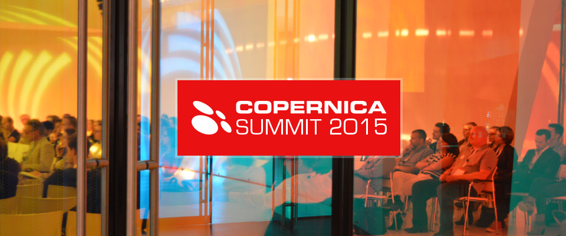
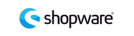
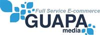

[Programma](https://www.copernica.com/nl/copernica-summit/programma-copernica-summit "Copernica Summit programma")

[Sprekers](https://www.copernica.com/nl/copernica-summit/sprekers-copernica-summit "Copernica Summit sprekers")

[Copernica
partners](https://www.copernica.com/nl/copernica-summit/copernica-partners "Copernica partners")

[Contact &
locatie](https://www.copernica.com/nl/copernica-summit/contact-locatie "Copernica Summit contact & locatie")

Hét event waar je de laatste trends en ontwikkelingen hoort over email
marketing. Dat is het Copernica Summit. Voor de vijfde keer vindt op
dinsdag 15 september het Summit plaats in het Media Plaza van Jaarbeurs
Utrecht. Hoe begeleid je prospects door het aankoopproces en stimuleer
je ze tot aankoop met email marketing? Hoe automatiseer je email
marketing campagnes? Wat zijn de best practices om meer conversie te
behalen uit je webwinkel? Sprekers uit binnen- en buitenland geven
antwoord op deze en vele andere vragen.

Daarnaast is het Copernica Summit het event waar je alles hoort over de
(nieuwste) producten van Copernica. Train en certificeer jezelf om alles
te halen uit Copernica Marketing Software of maak kennis met
[ResponsiveEmail.com](https://www.responsiveemail.com/ "ResponsiveEmail.com"),
[MailerQ](https://www.mailerq.com/ "MailerQ") en
[SMTPeter](http://www.smtpeter.com/ "SMTPeter").

### Copernica Summit sponsoren?

Een groei van 30% in het aantal bezoekers (700 over de gehele dag), 13
mediapartners, 8.000 pageviews op de speciale landingspagina en een
gemiddelde waardering van een 7,5. Dat zijn de resultaten van het
Copernica Summit 2014. Sponsoren waarderen de kwaliteit van de
bezoekers, mede door een ideale mix van Copernica-gebruikers, -partners
en prospects die geïnteresseerd zijn in de nieuwste ontwikkelingen op
het gebied van email marketing. Genoeg redenen om de vijfde editie van
het Copernica Summit te sponsoren.

De sponsorpakketten zijn nu bekend en [bekijk je
hier](EventsNL/SponsorpakkettenSummit2015.pdf "Sponsorpakketten Copernica Summit").
We raden aan om zo snel mogelijk je deelname aan het Summit kenbaar te
maken. Hoe eerder, hoe meer marketingmogelijkheden we je voorafgaand aan
het Summit kunnen bieden en hoe meer je er ook uit kan halen. Daarnaast
zijn de pakketten beperkt - op is op.

[Bekijk de sponsorpakketten](EventsNL/SponsorpakkettenSummit2015.pdf)

Maak je sponsordeelname aan het Copernica Summit dan ook zo snel
mogelijk bekend bij Ralph van den Broeck per mail
[ralph@copernica.com](mailto:ralph@copernica.com) of telefonisch 020 208
1143.

  Platinum sponsors
  -----------------------------------------------------------------------------------------------------------------------------------------------------------------------------------------------------------------------------------------------------------------------------------------------------------------------------------------------
   

  Gold sponsors
  -----------------------------------------------------------------------------------------------------------------------------------------------------------
  

